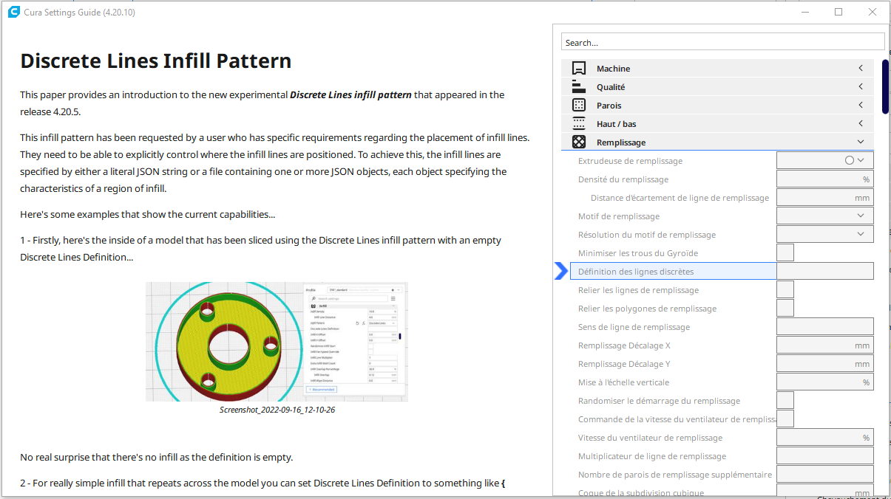

# Cura Master Settings Guide

This Cura plug-in provides additional explanations with pictures and animations for many Cura settings. It's based on the exelent Plugin [SettingsGuide](https://github.com/Ghostkeeper/SettingsGuide#readme) developed by [Ghostkeeper](https://github.com/Ghostkeeper). But I have integrated somme additionnal articles relative to the [Cura Master Release](https://github.com/smartavionics/Cura).

## Installation

You can install this plug-in From source: Download the latest source code [from Github](https://github.com/5axes/CuraMasterSettings/archive/master.zip). In Cura, click on "Help", "Show configuration folder". Navigate to the "plugins" subfolder and unpack the .zip file from Github there. Rename the folder to "CuraMasterSettings" (removing any suffix that Github added such as "-master").  Restart Cura.
 
## Usage

To use this plug-in, right click on a setting you'd like to know more about. Then click "Settings Guide".

Alternatively, click on "Extensions" in the application menu, then click on "Settings Guide"

