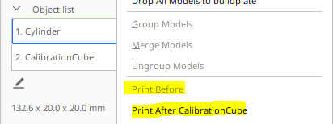

Set Print Sequence Manually
====
Allows you to order the object list to manually set the print sequence. First object from the list will be printed first.

Once activated, you can use a new menu to change the order in which the parts on the printing plate are printed.

To be visible, the parameter [Print Sequence](print_sequence.md) must be set to "One at a time".