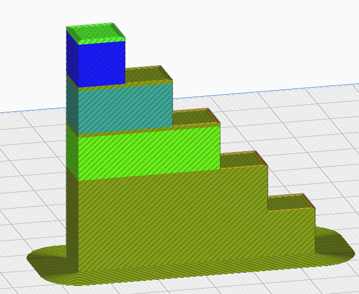
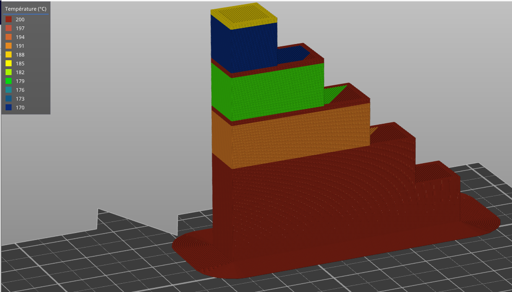

Small Layer Printing Temperature
====

This setting gradually reduces the printing temperature while printing at lower speeds due to the [minimum layer time](cool_min_layer_time.md).

Depending on the minimum time required to print a layer, the printing temperature is gradually lowered until the value of Small Layer Printing Temperature for the slowest layer.

