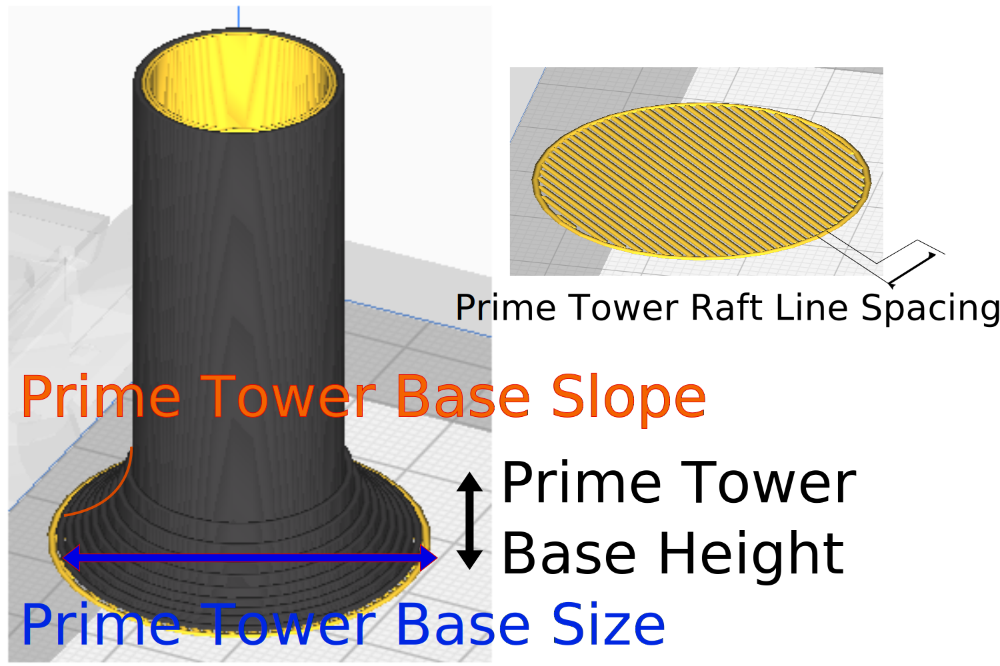

Prime Tower Base Size
====
The width of the prime tower brim/base. A larger base enhances adhesion to the build plate, but also reduces the effective print area.

You can modify these settings to help improve the reliability of your prime towers. You can also use them to calibrate how well your prime tower adheres to the build plate for increased print success, or to avoid over-adhesion that may damage your build plate.
