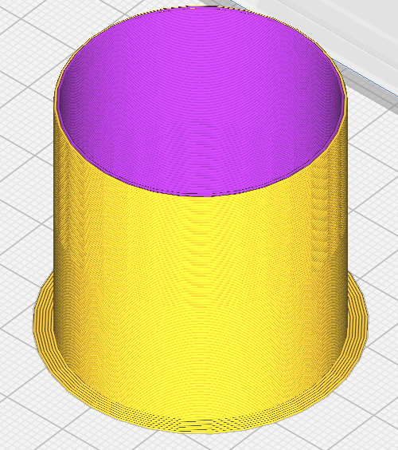
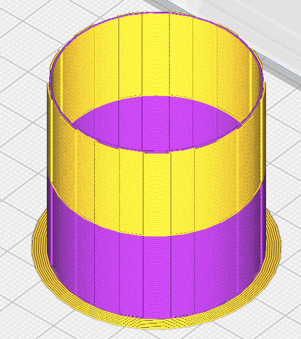

Prime Tower Type
====
How to generate the prime tower:

- **Normal**: create a bucket in which secondary materials are primed

- **Interleaved**: create a prime tower as sparse as possible. This will save time and filament, but is only possible if the used materials adhere to each other.

