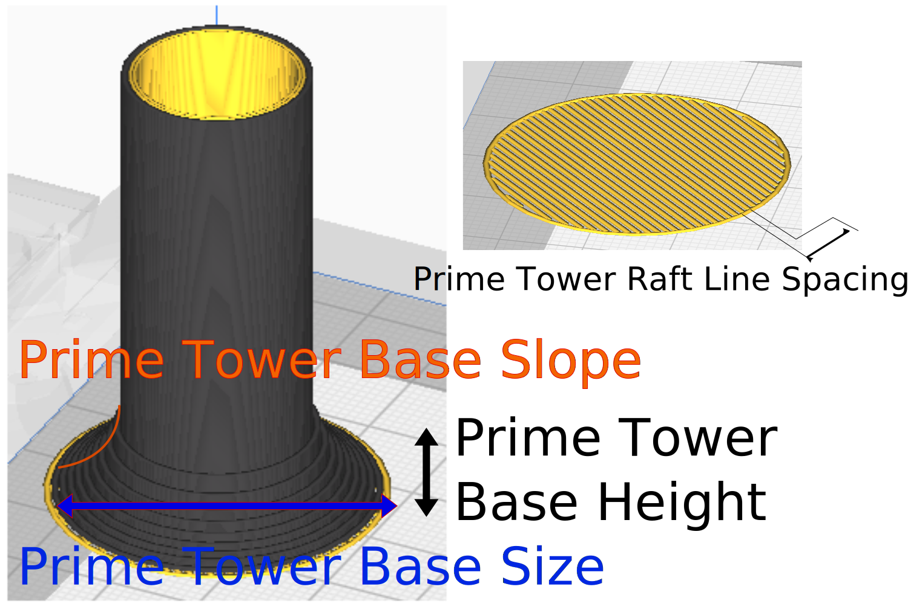

Prime Tower Raft Line Spacing
====
The distance between the raft lines for the unique prime tower raft layer. Wide spacing makes for easy removal of the raft from the build plate.

You can modify these settings to avoid over-adhesion that may damage your build plate.