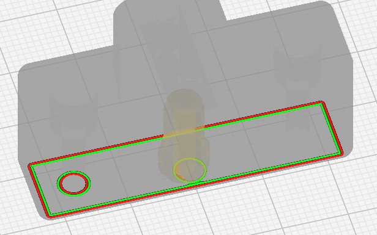
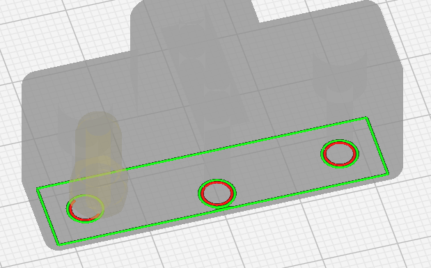

Group Outer Walls
====
With this option Outer walls of different islands in the same layer are printed in sequence. When enabled the amount of flow changes is limited because walls are printed one type at a time, when disabled the number of travels between islands is reduced because walls in the same islands are grouped.

