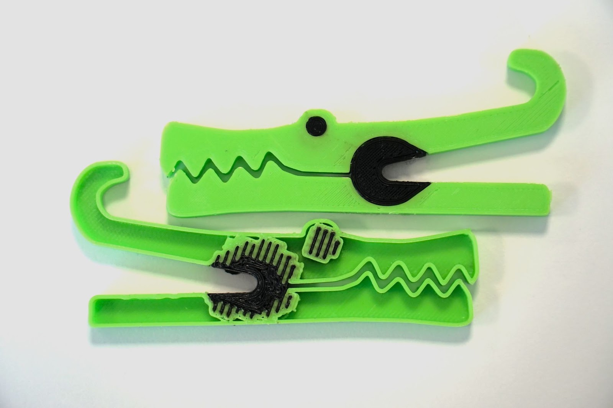
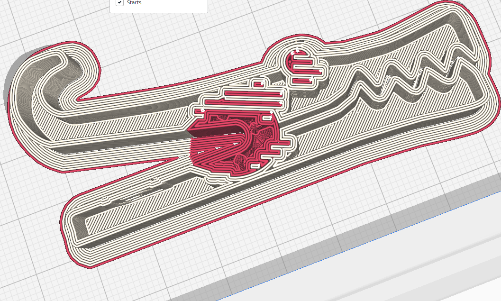

Generate Interlocking Structure
====

This option enabled the generation, at the locations where models touch, generate an interlocking beam structure. This improves the adhesion between models, especially models printed in different materials.

This alternating overlapping pattern physically ‘locks’ the two materials together so that the strength of the bond between them is no longer dependent on how compatible they are, but is instead only limited by the strength of the weakest of the two materials.

 
The implications of this are huge. Up until now, when printing multi-material prints on, for example, a printer capable of dual extrusion, you would have had to consult a material compatibility chart like this one to tell if the materials you plan to use would work together. Many materials need to be printed at different temperatures and others are chemically incompatible. Using material interlocking, any material is fair game.

 
You also don’t have to worry about using workarounds such as designing parts that use joints, clips, or fancy print-in-place tricks. You no longer need to print a part in multiple pieces and assemble them using adhesives or fasteners. Instead, just load any part designed for multiple material printing into Cura and slice it with the new ‘Generate Interlocking Structure’ setting enabled.

 
To check that the setting has been properly applied, you can go to the preview tab in Cura, and use the scroll bar on the right side of the screen to scrub to a part of the print where the two materials meet. The interlocking pattern will show in the sliced part like so:

Interlocking structures can be adapted using the following parameters :
* [Interlocking Beam Width](interlocking_beam_width.md)
* [Interlocking Structure Orientation](interlocking_orientation.md)
* [Interlocking Beam Layer Count](interlocking_beam_layer_count.md)
* [Interlocking Depth](interlocking_depth.md)
* [Interlocking Boundary Avoidance](interlocking_boundary_avoidance.md)

Note: this setting is only available when using advanced and expert setting presets. Or if enabled via the preferences menu. 

 
