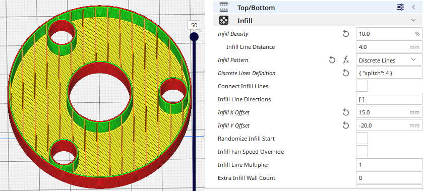
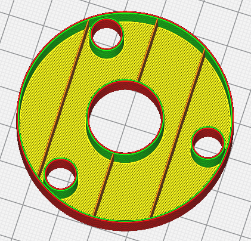
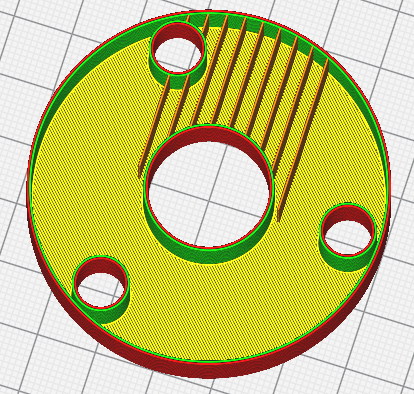
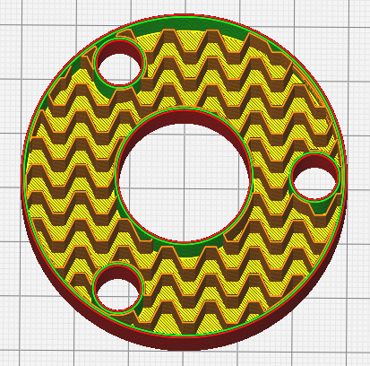
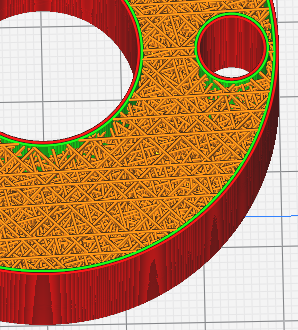
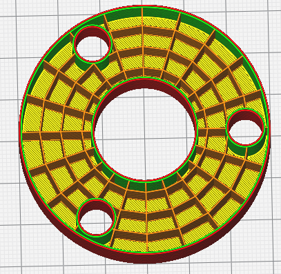

# Discrete Lines Infill Pattern

This  experimental **_Discrete Lines infill pattern_**  appeared in the release 4.20.5. This infill pattern has been requested by a user who has specific requirements regarding the placement of infill lines. They need to be able to explicitly control where the infill lines are positioned. To achieve this, the infill lines are specified by either a literal JSON string or a file containing one or more JSON objects, each object specifying the characteristics of a region of infill.

Here's some examples that show the current capabilities...

1 - Firstly, here's the inside of a model that has been sliced using the Discrete Lines infill pattern with an empty Discrete Lines Definition...

No real surprise that there's no infill as the definition is empty.

2 - For really simple infill that repeats across the model you can set Discrete Lines Definition to something like ***{ "xpitch": 4 }*** (remember, it's JSON syntax so you need to enclose the definition of xpitch with { and }). This is saying, generate infill lines every 4 mm in the x direction (and as long as required in the y direction). So now you get this...

3 - You could also provide more than one definition so let's add some lines spaced across the y axis using ***{ "xpitch": 4, "ypitch": 10 }***...

Obviously, you can't type much in that little settings text field so, instead, ***you can provide the settings as a JSON file and simply put the name of the file in the settings field prefixed with @*** . The file name can either be absolute or relative to the directory the project file was loaded from or the user's home directory.

# Sample capabilities

All the examples now are specified as a JSON file. Here's a really simple example that introduces the "x" member name. This expects to be followed by an array of x coordinates and generates a single line for each coordinate. As you would expect, there's a "y" member name too.

`{
 "x": [-18, 0, 15]
 }`

*This sample code can be found on the following link : [J1.json](../../sample_files/J1.json)*

By default, the infill is clipped to fit the outline of the model being filled but you can also specify limits in all three, (x, y & z) dimensions. So here we show repeated lines that are limited to a central region of our model...

`{
 "xpitch": 3,
 "xmin": -15,
 "xmax": 15
}`

*This sample code can be found on the following link : [J2.json](../../sample_files/J2.json)*

We can limit in the y direction also...

`{
 "xpitch": 3,
 "xmin": -15,
 "xmax": 15,
 "ymin": 0
}`

*This sample code can be found on the following link : [J4.json](../../sample_files/J4.json)*

The definition file can contain not just a single definition but an array of definitions and they are processed sequentially. This following example shows the x lines in the central region as before but also, now has y lines in the outer regions as well...

`[
 {
 "xpitch": 3,
 "xmin": -15,
 "xmax": 15
 },
 {
 "ypitch": 5
 }
]`

*This sample code can be found on the following link : [J5.json](../../sample_files/J5.json)*

### Cliping area

You will have noticed that the y lines are excluded from the x lines region and that's because after each area of infill has been defined, it clips that area from the model. This default behaviour can be altered by setting "clip" to False like this...

`[
 {
 "clip": false,
 "xpitch": 3,
 "xmin": -15,
 "xmax": 15
 },
 {
"ypitch": 5
 }
]`

*This sample code can be found on the following link : [J6.json](../../sample_files/J6.json)*

### enable

There's a couple more members that take boolean values: "enable" and "zigzag".

Setting "enable" to false will cause the current definition to be ignored, this is useful as you can't comment JSON files so while experimenting it's good to have a means of turning individual definitions on and off.

### zigzag

Setting "zigzag" to true joins up the ends of the lines where they meet the model walls (just like zigzag pattern infill)...

`[
 {
 "ypitch": 5,
 "zigzag": true
 }
]`

Here's the plan view of that with the shell not visible...  

*This sample code can be found on the following link : [J7.json](../../sample_files/J7.json)*

Finally, there's the "angle" member that let's you specify a rotation of the lines...

`[
 {
 "ypitch": 5,
 "angle": 10
 }
]`

*This sample code can be found on the following link : [J8.json](../../sample_files/J8.json)*

# Currently implemented members

In the descriptions below:

- NUM = number

- INUM = either a NUM or \[NUM, NUM\] in the latter case, the value is interpolated between the two values with the first value being used for the lowest layer in the infill region and the second value is used for the topmost layer in the infill region.

- BOOLEAN = either **true** or **false** (not quoted!) or a non-zero number for true and zero for false.

Here's the full list of the currently implemented members.

- "xpitch": INUM or "from-settings", "ypitch": INUM or "from-settings".  
Generate lines at the specified pitch along either the x or y axes. The pitch can be specified as NUM or \[NUM, NUM\] or the string "from-settings". If "from-settings" is used, the pitch is the value of the Infill Line Distance setting.

- "x": ARRAY_OF_NUM, "y": ARRAY_OF_NUM  
Generate lines at the specified locations along either the x or y axes.

- "xmin": NUM, "xmax": NUM, "ymin": NUM, "ymax": NUM, "zmin": NUM, "zmax": NUM  
Limit the infill area to the specified limits.

- "rings": INUM or "from-settings"  
Generate lines at the specified pitch as circular rings around the infill origin. The pitch can be specified as NUM or \[NUM, NUM\] or the string "from-settings". If "from-settings" is used, the pitch is the value of the Infill Line Distance setting. If "spokes" are being generated, the number of segments in each ring will be the same as the number of spokes. Otherwise the rings will be smooth.

- "r": ARRAY_OF_NUM  
Generate lines at the specified radii around the infill origin. If "spokes" are being generated, the number of segments in each ring will be the same as the number of spokes. Otherwise the rings will be smooth.

- "rmin": NUM, "rmax": NUM  
Limit the infill area to the specified radial limits around the infill origin. If "spokes" are being generated, the number of segments in the circumference of the infill area will be the same as the number of spokes. Otherwise the circumference of the infill area will be smooth.

- "spokes": NUM  
Generate NUM equally spaced lines radiating from the infill origin.

- "contours": INUM or "from-settings"  
Generate lines at the specified pitch inset from the infill region's outline. The pitch can be specified as NUM or \[NUM, NUM\] or the string "from-settings". If "from-settings" is used, the pitch is the value of the Infill Line Distance setting.

- "angle": NUM or "from-settings"  
Rotate the generated lines this number of degrees anti-clockwise. If "from-settings" is used, the angle is as specified in the Infill Line Directions setting which, if empty, defaults to 45 and 135 degrees.

- "waveform": "sine" or "triangle" or "square" or ARRAY_OF_NUM  
Generate the specified waveform instead of a straight line. The amplitude and wavelength of the waveform are specified separately. Waveforms can also be specified as an array of numbers that provide the amplitude of the wave at regularly spaced intervals within a single wavelength. Each element in the array is an amplitude scaling value and should be in the range -1 to 1.

- "wavelength": INUM  
The wavelength of the waveform.

- "amplitude": INUM  
The zero-peak amplitude of the waveform.

- "clip": BOOLEAN  
Specify whether the current infill region is clipped from the model area so subsequent definitions don't apply to the same area. Defaults to true.

- "enable": BOOLEAN  
Specify whether the current definition is used or not. Defaults to true.

- "zigzag": BOOLEAN  
Specify whether the ends of the infill lines that meet the model outline are connected (like zigzag pattern infill) or not. Defaults to the value of the Connect Infill Lines setting.

- "scattered": BOOLEAN  
Specify whether to generate a scattered infill pattern or not. The scattered infill pattern generates lines with randomised spacing and direction on each layer. Assumes that the Infill Line Pattern is either the default '\[ \]' or set to two values 90 degrees apart.

## Notes

All lengths are in mm.

The x and y coordinates are relative to the infill origin which is the middle of the mesh being filled with offset by the Infill X/Y Offset settings.

The z coordinates are relative to the buildplate.

# Usability

One problem with JSON is that it is very unforgiving in terms of syntax. If you miss out a comma or bracket, or have too many, it will fail to read the definition and you won't get any infill generated.

Worse still, the error reporting is currently very primitive. If the definition file cannot be read or it contains syntax errors you will get a message in the cura.log file. So, for example, the following bad JSON file (it's missing a comma) will generate the error below...

`[
 {
 "ypitch": 5
 "angle": 10
 }
]`

 ***2022-09-16 14:03:02,901 - DEBUG - [EngineErrorThread] UM.Backend.Backend._backendLog [110]: [Backend] [ERROR] DiscreteLinesInfill: Error parsing JSON (offset 28): Missing a comma or '}' after an object member.***

Unfortunately, there's currently no mechanism in Cura to get an error message generated in the engine that does the slicing back to be displayed in the UI.

## infill X and Y Offset

The infill X and Y offsets are still active with this mode so here is an example where the infill lines should cross at the middle of the model but the infill has been shifted...

# "xpitch" and "ypitch" member

Latest addition: the "xpitch" and "ypitch" values can either be a single number, in which case, the same pitch value is used for all the layers in the current infill region. Alternatively, you can specify a two element array and the first element is the pitch value for the lowest layer in the region and the second element is the pitch value for the topmost layer in the region and for the layers between, the pitch value is interpolated between those two limits. Obviously, the gradient can't be too shallow otherwise the infill won't be supported by the layers below. Anyway. here's an example that defines three infill regions, a region that is below 4mm, a region from 4mm up to 15mm and the last region that is above 25mm. The lowest region has a pitch of 10, the highest region has a pitch of 8 and the middle region has a pitch that goes from 10 to 8 as z increases.

`[
 {
 "xpitch": 10,
 "zmax": 4
 },
 {
 "xpitch": [10,8],
 "zmax": 15,
 "zmin": 4
 },
 {
 "xpitch": 8
 }
]`

And this is what you get (sans shell for clarity)...

*This sample code can be found on the following link : [J10.json](../../sample_files/J10.json)*

## Variable picth density

Here's another example showing the infill density going from 10% at the bottom of the model to close to 100% at the top...

`[
 {
 "xpitch": [10, 0.4],
 "ypitch": [10, 0.4]
 }
]`

 

*This sample code can be found on the following link : [J11.json](../../sample_files/J11.json)*

# Waveform generation

If straight line infill is too boring, you can also have wiggly lines...

`[
{
"xpitch": 5,
"waveform": "sine"
"wavelength": 10,
"amplitude": 5,
"zigzag": true
}
]`

*This sample code can be found on the following link : [J12.json](../../sample_files/J12.json)*

The waveform shape can be specified as an array of amplitudes (between -1 and 1) like this...

`[
 {
 "xpitch": 5,
 "waveform": [0.25, 1.0, 0.25, 0.0, -0.25, -1.0, -0.25, 0.0],
 "wavelength": 8,
 "amplitude": 2,
 "zigzag": true
 }
]`

*This sample code can be found on the following link : [J13.json](../../sample_files/J13.json)*

Finally, because the waveform amplitude and wavelength can be varied with layer height you can achieve wacky stuff like this example where the sine wave amplitude goes from 0 to 5.

`[
 {
 "xpitch": 5,
 "waveform": "sine",
 "wavelength": 10,
 "amplitude": [0, 5]
 }
]`

Here's a bottom view of that without the zigzags or shell...

*This sample code can be found on the following link : [J14.json](../../sample_files/J14.json)*

So there's (almost) straight lines at the bottom and sine waves at the top.

## Waveform square waves

The above described mechanism for specifying the shape of a waveform has a major drawback in that it doesn't allow the creation of waveforms that have zero rise and fall times, e.g. square waves. A square wave could be described using 4 amplitudes like this example

`[
 {
 "ypitch": 5,
 "waveform": [-1, 1, 1, -1],
 "wavelength": 8,
 "amplitude": 2,
 "zigzag": true
 }
]`

But that produces sloped lines between the horizontal portions of the waveform, as you can see here...

*This sample code can be found on the following link : [J15.json](../../sample_files/J15.json)*

I you want to specify that a transition should take zero time. The current scheme is to mark amplitude value changes that should occur "instantaneously" with a string element in the array, so the above example would now look like:

`[
 {
 "ypitch": 5,
 "waveform": [-1, "", 1, 1, "", -1],
 "wavelength": 8,
 "amplitude": 2,
 "zigzag": true
 }
]`

The "" elements are indicating that the transitions from -1 to 1 and 1 to -1 should take zero time. And now we get...

*This sample code can be found on the following link : [J16.json](../../sample_files/J16.json)*

### Sample waveform code

Don't know if i will ever use a motif like this one.. But you will find some sample waveform code ,

`[
 {
 "clip": false,
 "ypitch": 10,
 "waveform": [1.0, 0.25, 0.0, 0.0, -0.25, -1.0,-1.0,"",1.0],
 "wavelength": 10,
 "amplitude": [3,5],
 "zmax": 10,
 "zigzag": true
 },
 {
 "clip": false,
 "ypitch": 10,
 "waveform": [1.0, 0.25, 0.0, 0.0, -0.25, -1.0,-1.0,"",1.0],
 "wavelength": 10,
 "amplitude": 5,
 "zmin": 10,
 "zigzag": true
 }
]`

*This sample code can be found on the following link : [J17.json](../../sample_files/J17.json)*

### 5axes

I don't think so... but by the way they are something strange concerning the use of the double quotation mark in the waveform definition. If you use it alone at the end of the sequence it gives you a different behavior.

`"waveform": [1.0, 0.25, 0.0, 0.0, -0.25, -1.0,-1.0,"",1.0],`

`"waveform": [1.0, 1.0, 0.25, 0.0, 0.0, -0.25, -1.0,-1.0,""],`

Or

`"waveform": ["", 1.0, 1.0, 0.25, 0.0, 0.0, -0.25, -1.0,-1.0],`

If you abuse also of the double quotation mark can also give you some strange ( but interesting behaviour ) Ie :

`"waveform": ["","","","",1.0,1.0, 0.25, 0.0, 0.0, -0.25, -1.0,-1.0],`

# "scattered" member

"scattered" has been added, it's simple to use...

`[
 {
 "ypitch": "from-settings",
 "scattered": true
 }
]`

*This sample code can be found on the following link : [J19.json](../../sample_files/J19.json)*

With specified user pitch.

`[
 {
 "ypitch": 3,
 "scattered": true
 }
]`

*This sample code can be found on the following link : [J20.json](../../sample_files/J20.json)*
## Sample Scattered code

`[
 {
 "ypitch": 3,
 "ymax": 0,
 "ymin": -20,
 "xmin": -15,
 "xmax": 10,
 "scattered": true
 },
 {
 "xpitch": "from-settings",
 "waveform": "triangle",
 "wavelength": 8,
 "zigzag": 1,
 "amplitude": 2
 }
]`

*This sample code can be found on the following link : [J21.json](../../sample_files/J21.json)*

# "rings" and "spokes" member

Next we have "rings" and "spokes" which let you create spiderweb like infill...

`[
 {
 "rings": "from-settings",
 "spokes": 20
 }
]`

*This sample code can be found on the following link : [J22.json](../../sample_files/J22.json)*

## Offset the infill

Even more spider web like if you offset the infill...

Notice how the spokes reduce in density at the origin.

# r member

The "r" member let's you specify individual radii for rings like this...

`[
 {
 "r": [ 17, 20 ],
 "spokes": 20
 }
]`

*This sample code can be found on the following link : [J23.json](../../sample_files/J23.json)*

# rmin & rmax member

"rmin" and "rmax" let you specify the min and max radii of the region to be filled. In this example, the scattered infill is limited to between 15 and 20 mm from the infill origin and everywhere else gets the triangle waveform...

`[
 {
 "ypitch": "from-settings",
 "rmax": 20,
 "rmin": 15,
 "scattered": true
 },
 {
 "xpitch": "from-settings",
 "waveform": "triangle",
 "wavelength": 8,
 "amplitude": 2
 }
]`

*This sample code can be found on the following link : [J24.json](../../sample_files/J24.json)*

# Contours member

And then we have "contours"...

`[
 {
 "contours": "from-settings"
 }
]`

This image is using infill density of 20%, the above examples were using 10%.

*This sample code can be found on the following link : [J25.json](../../sample_files/J25.json)*

The following settings are defined in [fdmprinter.def.json](https://github.com/smartavionics/Cura/blob/mb-master/resources/definitions/fdmprinter.def.json) : discrete_lines_infill_definition