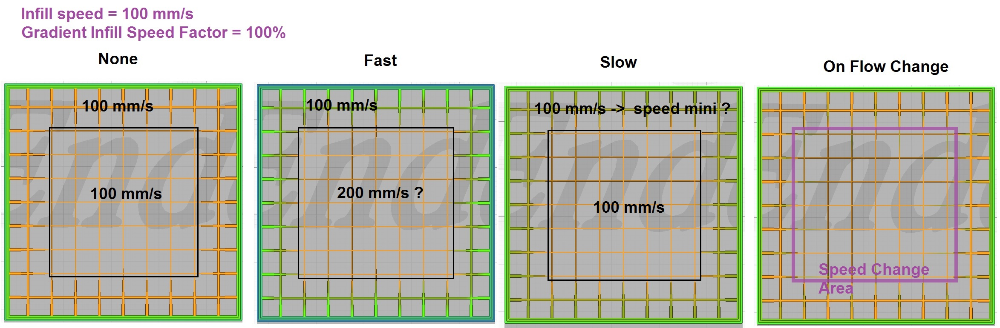

# Gradient Infill Speed Scheme

The speed modification scheme to use when printing [gradient infill](gradient_infill_type.md). Fast alters the print speed to keep the extrusion rate constant, the print speed can both increase and decrease. Slow is similar except the print speed can only decrease. On flow change reduces the print speed where the infill flow is changing.

## Gradient Infill Speed Scheme option 

- Fast
- Slow
- On Flow Change

The fast and slow schemes both modify the print speed so that throughout all of the infill, the extruder will turn at the same speed. So for both schemes, when the flow rate doubles, the speed has to halve, and so on.

The fast scheme uses the normal print speed for normal flow so if that normal infill speed is 100 mm/S you will indeed get 200 mm/S where the flow is 50% and 50 mm/S where the flow is 200%. This is assuming the infill speed factor is 100%. If you modify that the speed changes will be less or more depending on whether you reduce the speed factor or increase it. Note that changing the speed factor from 100% will make the extruder rate change.

The slow scheme uses the normal print speed for the lowest flow and so all other flows will make the print speed reduce. So in your example, with the slow scheme, at 50% flow the speed will be 100 mm/S, at 100% flow the speed will be 50 mm/S and at 200% flow, the speed will be 25 mm/S.

### [Gradient Infill Speed Factor](gradient_infill_speed_factor.md)
Scales the effect the infill speed scheme has on the print speed.

### [Gradient Infill Distance](gradient_infill_dist.md)
The distance over which the infill flow is reduced from max to min.

The following settings are defined in [fdmprinter.def.json](https://github.com/smartavionics/Cura/blob/mb-master/resources/definitions/fdmprinter.def.json) : gradient_infill_speed_scheme

