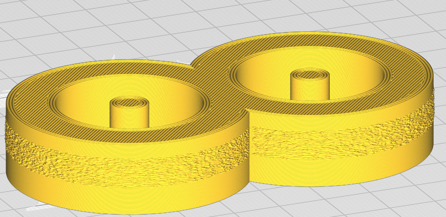
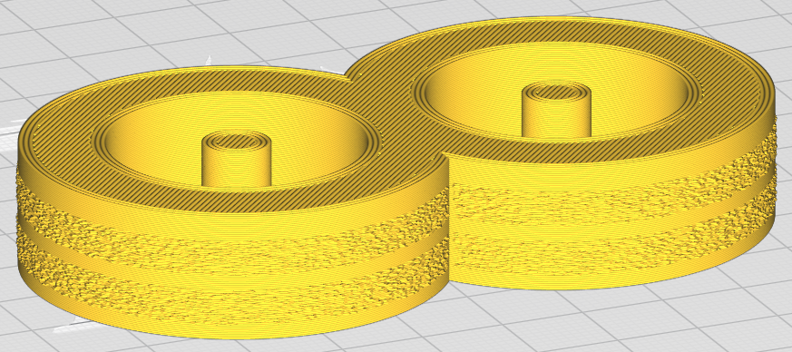

# Fuzzy Skin Layer Ranges

Specify the layers to have fuzzy skin. Can be empty (fuzz all layers), a single number (max layer to be fuzzed) or one or more ranges of the form START-END separated by commas or spaces.

The following settings are defined in [fdmprinter.def.json](https://github.com/smartavionics/Cura/blob/mb-master/resources/definitions/fdmprinter.def.json) : magic_fuzzy_skin_layer_ranges
