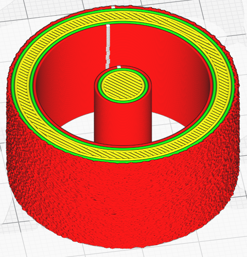
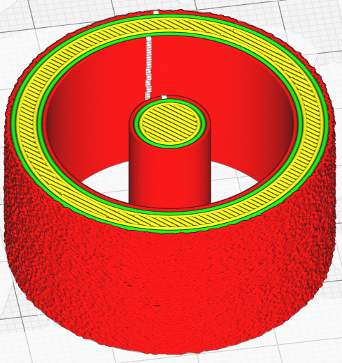

# Fuzzy Skin Outside Only Heuristics

A bit mask that selects the heuristic(s) to use when determining if a wall is facing outside or not (YMMV). The bit mask values are: 1 = convex hull heuristic. 2 = 'ray-trace' heuristic.

The parameter is only visible if the [Fuzzy Skin Outside Only](../experimental/magic_fuzzy_skin_outside_only.md) is activated. Normally for Cura the notion of external can also include boundaries which are external to the geometry but which are found inside a set. With this option, it is possible to refine the detection of external boundaries so that only the outer walls are really retained.

The following settings are defined in [fdmprinter.def.json](https://github.com/smartavionics/Cura/blob/mb-master/resources/definitions/fdmprinter.def.json) : magic_fuzzy_skin_outside_only_heuristics
