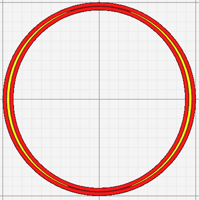

# Minimum Gap Area

Filter out gaps whose area is less than this.  To be effective the option [Fill Gaps Between Walls](../shell/fill_perimeter_gap.md) must be active.

The following settings are defined in [fdmprinter.def.json](https://github.com/smartavionics/Cura/blob/mb-master/resources/definitions/fdmprinter.def.json) : min_gap_area