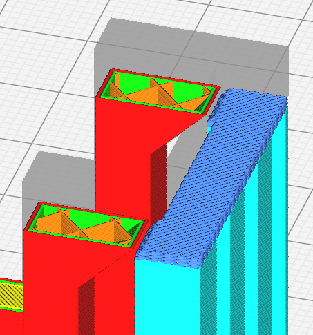
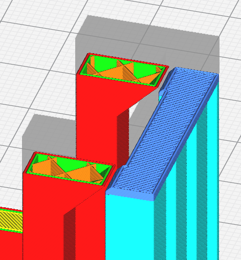

# Support Interface Wall Line Count

The number of walls with which to surround support interface. Adding a wall can make support print more reliably and can support overhangs better, but increases print time and material used.

The following settings are defined in [fdmprinter.def.json](https://github.com/smartavionics/Cura/blob/mb-master/resources/definitions/fdmprinter.def.json) : support_interface_wall_count