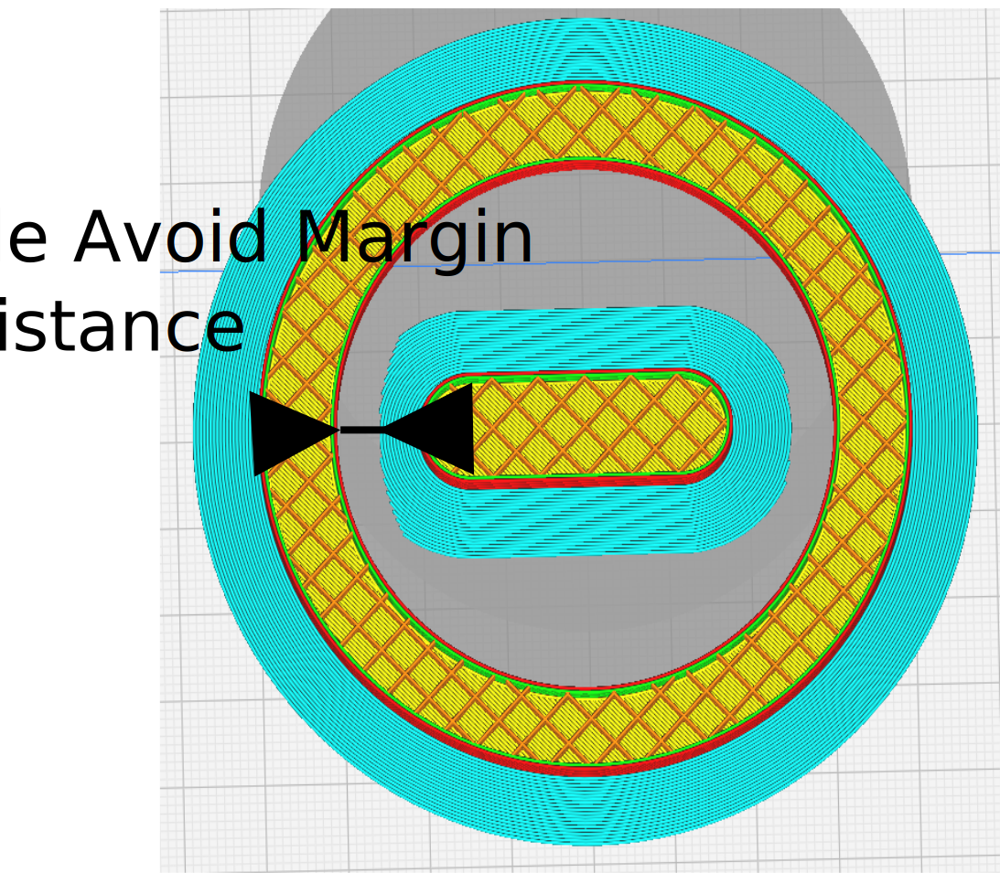

Brim Inside Avoid Margin
====

A part fully enclosed inside another part can generate an outer brim that touches the inside of the other part. This removes all brim within this distance specified by this value from internal holes.

To activate the [Brim Only On Outside](brim_outside_only.md) must be activated.