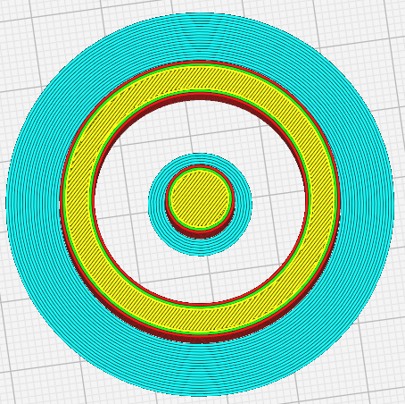
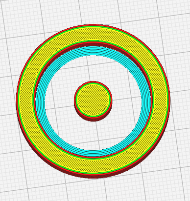
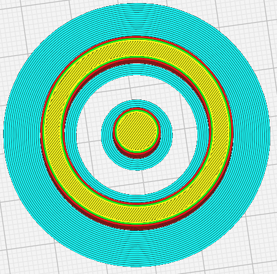

Brim Location
====
Print a brim on the outside of the model, inside, or both. Depending on the model, this helps reducing the amount of brim you need to remove afterwards, while ensuring a proper bed adhesion.

You can choose between the following options :

- Outside Only : Create a brim only on the outside of a part. 
- Inside Only : Create a brim only on the inside of a part.
- Everywhere : Creating brims on the outside and inside of a part.

**Note** : The notion of outside refers to the edge located on the outside of a part, but which may be inside the whole part.

This option is only visible if the [Build Plate Adhesion Types](adhesion_type.md) is defined on **Brim**..

