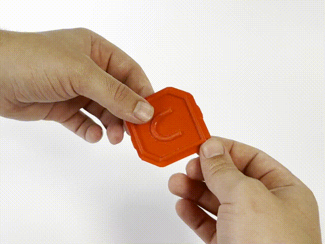

Smart Brim
====
Swap print order of the innermost and second innermost brim lines. This improves brim removal.

The  Smart Brim setting change how brims are printed so that they are significantly easier to remove. If you enable it in your Cura print settings, you should find your brims peel off easily as shown in the GIF above, and that they leave behind less (or no) excess material. 

Brims have been a long-standing solution to adhesion issues. They increase the surface area of your part on the print bed so that it is less likely to come loose during printing. They can be an invaluable tool when printing small or thin parts, or parts that are top-heavy. However, despite their utility, many people have spent countless hours tweaking and tuning their printers so that brims are unnecessary. All sorts of fancy glues, build surfaces, and more have been employed to avoid using them. Why? Because they can be a pain to remove. Often leaving behind excess material that needs to be cut or sanded away to get a clean final print.
This option has therefore been developed to facilitate separation between the border and the printed part.