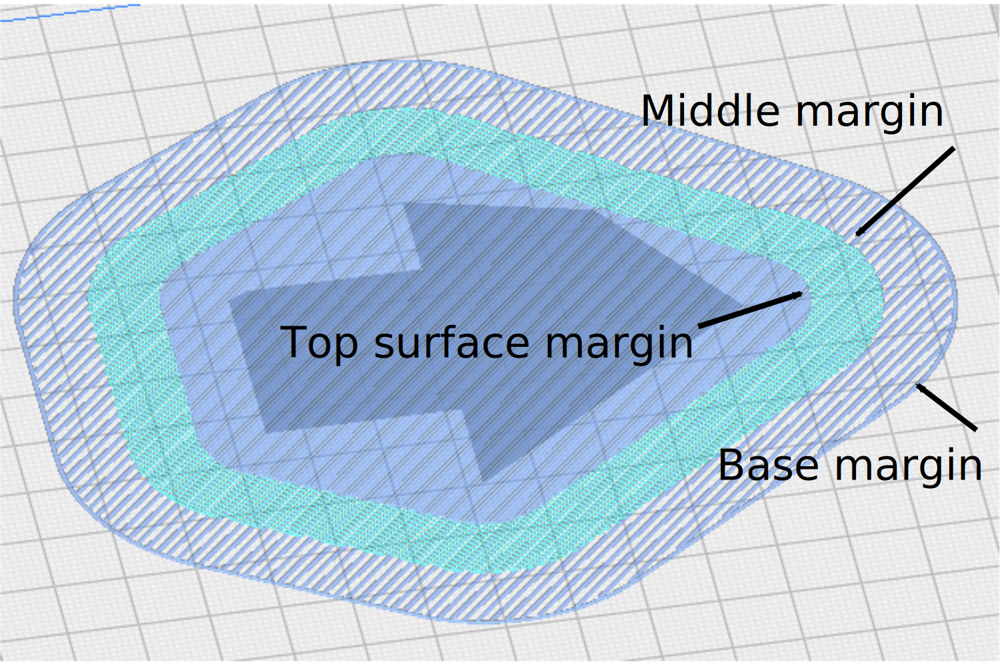

Raft Middle Extra Margin
====
If the raft middle is enabled, this is the extra raft area around the model which is also given a raft. Increasing this margin will create a stronger raft while using more material and leaving less area for your print.

