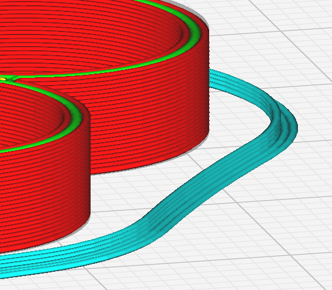

Skirt Height
====

Specifies the height of the skirt in layers. Each layer adds to the overall height of the skirt.

Printing the innermost skirt line with multiple layers makes it easy to remove the skirt.

The **Skirt Height** parameter is only visible if the [adhesion type](adhesion_type.md) is set to **Skirt**.