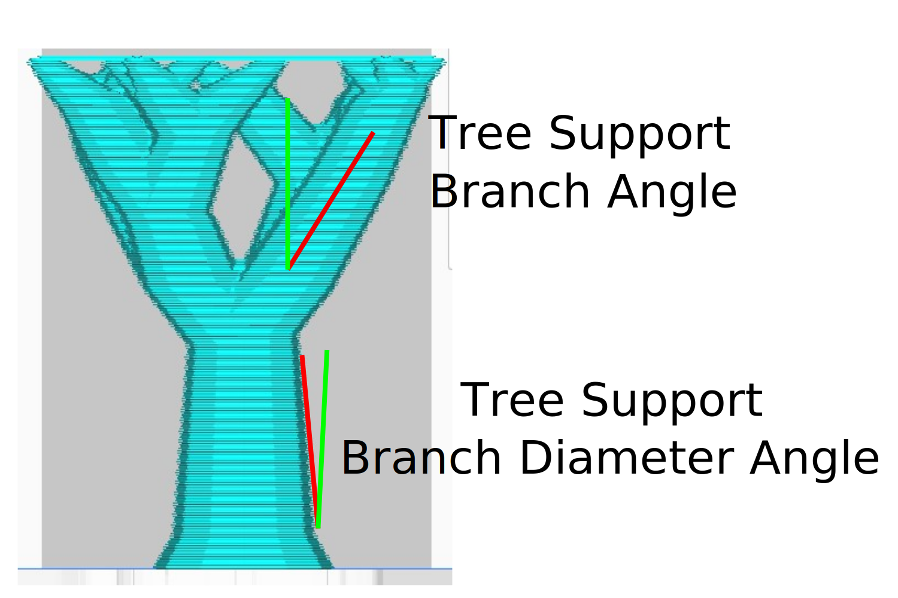

Preferred Branch Angle
====
This parameter determines the preferred angle for the branches, when they don't have to avoid the model. If you use a low angle, the branches will be more vertical and stable. If you use a high angle, the branches will merge faster.

