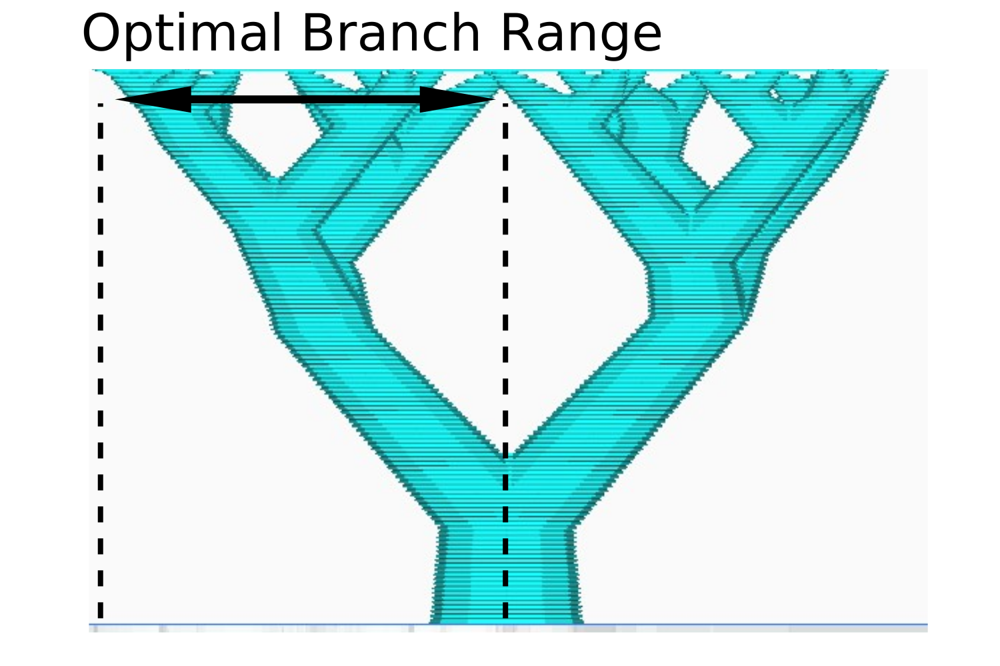

Optimal Branch Range
====
A recomendation to how far branches can move from the points they support. Branches can violate this value to reach their destination (buildplate or a flat part of the model). Lowering this value will make the support more sturdy, but increase the amount of branches (and because of that material usage/print time).

