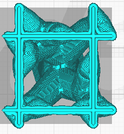

Branch Density
====

This parameter adjusts the density of the support structure used to generate the branch ends. A higher value will produce better overhangs, but the supports will be more difficult to remove. Use a support ceiling for very high values, or ensure that the density of the support is equally high at the ends.

