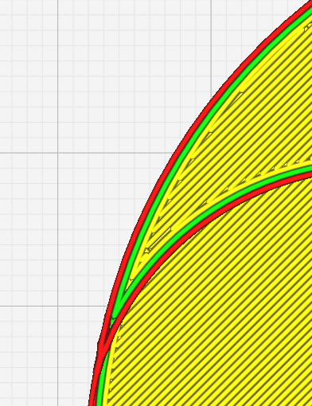
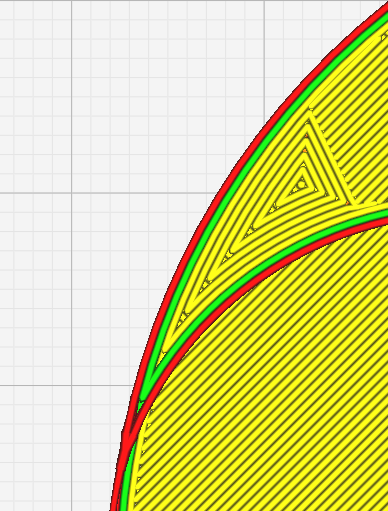

Small Top/Bottom Width
====

This value defines the size of **Small top/bottom regions** that are filled with contour parralel path instead of the default top/bottom pattern. This helps to avoids jerky motions.

**Small Top/Bottom Width** reduces jerky motions in small top/bottom surfaces, with [Small Top/Bottom On Surface](small_skin_on_surface.md) you can exclude the setting on the surface by activating or not the value specified in this option.

