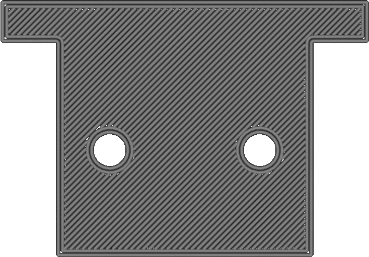

Vnější stěna před vnitřní
====
Toto nastavení určuje, které stěny jsou vytištěny jako první, vnější nebo vnitřní stěny.

Aktivace tohoto parametru má malý vliv na kvalitu i rozměrovou přesnost:
* Zlepší to rozměrovou přesnost. Přilehlé stěny obvykle vzájemně tlačí jedna na druhou, a to zejména v případě, když je šířka linie stěny menší než velikost trysky. Stěna, která je vytištěna jako první, bude zpevněna a potom nebude tolik tlačena. Proto vytisknutím nejprve vnější stěny získáte přesnější umístění vnější stěny.
* Pokud je výplň vytištěna před stěnami, sníží se tím množství výplně, které se objeví na povrchu. V opačném případě se nejprve vytiskne výplň, potom vnitřní stěny, které jsou výplní vytlačeny ven, a nakonec vnější stěna, která je vytlačena ven z vnitřních stěn. Vzorek by tedy mohl být viditelný zvenku. Pokud je vnější stěna vytištěna jako první, může vnější stěna ztuhnout, než ji může vnitřní stěna posunout.
* Tisk vnější stěny je pro převis obecně horší. Vnější stěna je dále od předchozí vrstvy než vnitřní stěna. Když je vnější stěna vytištěna jako první, ještě nemá přilnavost na vnitřní stěnu. Když je vnitřní stěna vytištěna jako první, vnější stěna se může k boční stěně bočně připojit.