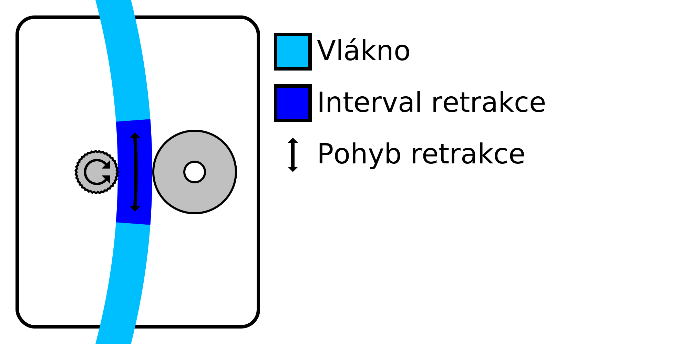

Maximální počet retrakcí
====
Podávací kolo musí vlákno uchopit, aby se mohlo správně pohybovat. Retrakce materiálu má často sklon opotřebovat vlákno do té míry, že ho podávací kolo již nemůže správně uchopit. Toto nastavení omezuje počet retrakcí v určité délce vlákna, aby se zabránilo tomuto obroušení.

Toto nastavení udává, kolikrát může být vlákno zataženo během délky vlákna označené nastavením [Interval minimální vzdálenosti extruze](retraction_extrusion_window.md). Jakékoli jiné retrakce během tohoto okna nebudou provedeny, ale tryska se bude jednoduše pohybovat bez retrakce.

Délka vlákna, během které je omezen počet retrakcí, je posuvné okno. Například s délkou okna 3 mm a maximálním počtem retrakcí 10 to znamená, že nová retrakce je povolena, jakmile je předchozí 10. retrakce provedena dále než 3 mm zpět na vlákně.

Snížení maximálního počtu retrakcí sníží broušení vlákna. To je užitečné pro měkčí materiály, jako je PVA. To však také zvýší strunování, protože se již nebude stahovat do pozice, kde to bylo zjevně žádoucí.