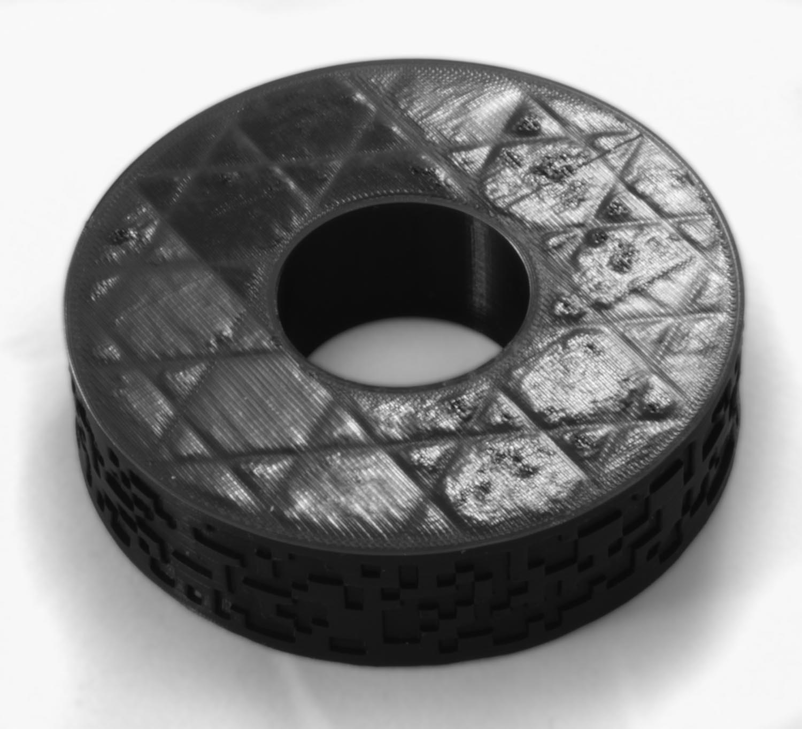

Polštářování
====
Polštářování je efekt, kdy se mezi výplňovými liniemi na horní straně modelu objevují malé vyboulení nebo důlky. Nejčastěji je vidět na (jinak) rovných horních površích při tisku vysokou rychlostí průtoku.

Příčiny
----
Polštář je kombinací několika efektů, které se kombinují a způsobují vyboulení na horní straně tisku.

Rozeznatelné vydutí horního pláště je ve skutečnosti formou [deformace](warping.md), kde je horní plášť stlačena okolními stěnami a podkladovou výplní. Když jsou stěny a výplň vytištěny nejprve ve spodních vrstvách, budou se během tisku pláště ochlazovat a smršťovat. Během smršťování tlačí stěny a výplň linie pláště dovnitř, až do bodu, kdy jsou vybouleny.

Dalším významným faktorem při polštářování je prohýbání linií pláště mezi liniemi výplně. V závislosti na vzdálenosti mezi liniemi výplně musí linie na plášti překlenout poměrně velkou vzdálenost. Pokud není chlazení dostatečné, plast se trochu prohýbá. To vede k tomu, že linie pláště k sobě méně přilnou, takže mezi nimi zůstávají mezery. Opravit to vyžaduje několik vrstev pláště.

Polštářový efekt má tendenci bobtnat spíše vzhůru než dolů. I když může existovat vzestupná a sestupná boule, vyboulení nahoru je běžnější, protože tryska se táhne na horní straně plastu, když prochází pláštěm, což na krátkou chvíli vyvíjí střižnou sílu nahoru. Jakmile jsou linie zakřivené směrem nahoru, deformační efekt je udržuje vzhůru.

Prevence
----
Existuje několik metod, jak zabránit polštářování v aplikaci Cura:
* Zvyšování [horní tloušťky](../top_bottom/top_thickness.md) je nejúčinnějším způsobem, jak polštáři zabránit. S více [horními vrstvami](../top_bottom/top_layers.md) mohou horní vrstvy spočívat na částečně uzavřených prostorech předchozích vrstev. To jim dává větší šanci na uzavření prostorů a vytvoření pevné horní vrstvy, která se neopírá o polštář. Obecně platí, že čím tenčí jsou vaše vrstvy, tím více vrstev budete potřebovat, protože tyto vrstvy nejsou tak silné.
* Zvětšení [hustoty výplně](../infill/infill_sparse_density.md) zmenší velikost mezer, které musí být vyplněny horním pláštěm. To usnadňuje vyplnění těchto mezer. Pokud to zkombinujete s [postupnými kroky výplně](../infill/gradual_infill_steps.md), většina hustoty výplně může zůstat stejná. Pouze horní část bude mít vyšší hustotu, aby se zabránilo efektu polštářování.
* Tisk nižší [teplotě](../material/material_print_temperature.md) zlepšuje přemostění a deformace obecně, také s horním pláštěm, což snižuje účinek polštářů.
* Podobně je třeba dbát na zvýšení rychlosti [chlazení](../cooling/cool_fan_speed.md), aby se zlepšilo přemostění.
* Omezení [rychlosti tisku pláště](../speed/speed_topbottom.md) zlepší přemostění přímo. To také pomůže tlačit horní vrstvy pláště lépe na spodní vrstvy. Tímto se otvory rychleji také uzavírají.