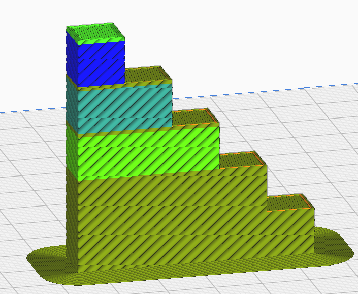
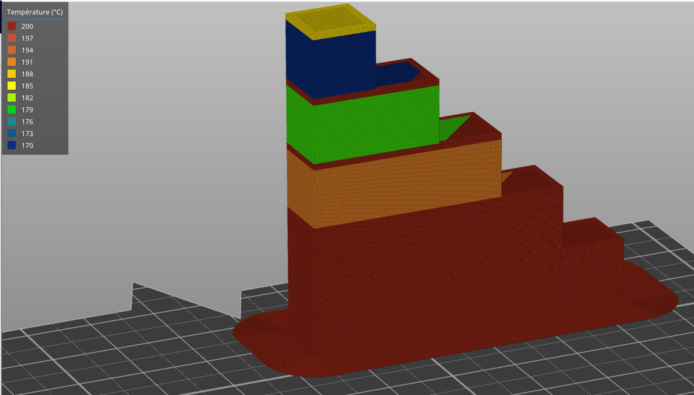

Température d'impression en cas de petites couches
====

Ce réglage réduit progressivement la température d'impression pendant l'impression à des vitesses inférieures en raison du [temps de couche minimum](cool_min_layer_time.md).

En fonction du temps minimum requis pour imprimer une couche, la température d'impression est progressivement abaissée jusqu'à la valeur de la température d'impression des petites couches pour la couche la plus lente.

