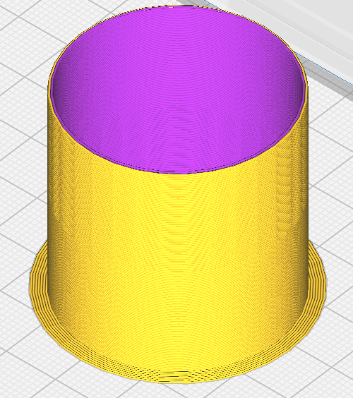
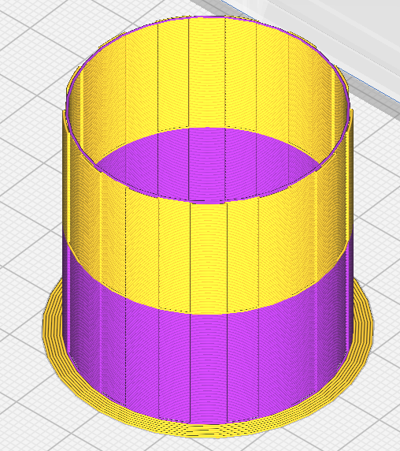

Type de tour d'amorçage
====
Comment générer la tour d'amorçage :

- **Normale**: créer un pot dans lequel les matériaux secondaires sont amorcés.

- **Entrelacée**: créez une tour d'amorçage aussi peu dense que possible. Vous économiserez ainsi du temps et du filament, mais cette opération n'est possible que si les matériaux utilisés adhèrent les uns aux autres.

