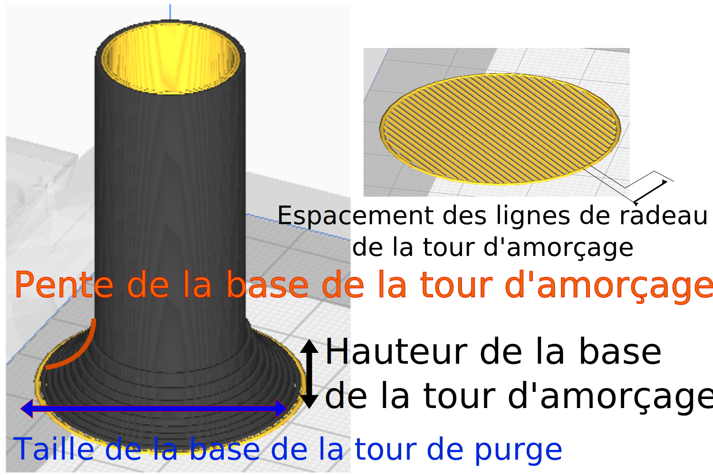

Espacement des lignes de radeau de la tour d'amorçage
====
Distance entre les lignes du radeau pour la couche unique du radeau de la tour de purge. L'espacement important permet de retirer facilement le chevron de la plaque de construction.

Vous pouvez modifier ces paramètres afin d'éviter une adhérence excessive qui pourrait endommager votre plaque de construction.

Ce paramètre n'est actif que si le [type d'adhérence](../platform_adhesion/adhesion_type.md) est réglé sur Radeau.