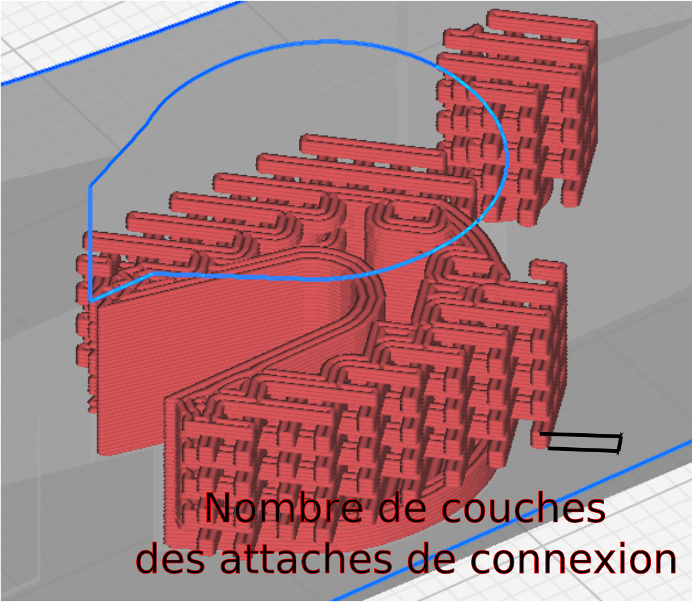

Nombre de couches des attaches de connexion
====
La hauteur des attaches de la structure de connexion, mesurée en nombre de couches. Moins il y a de couches, plus la structure est solide, mais plus elle est sujette à des défauts.

