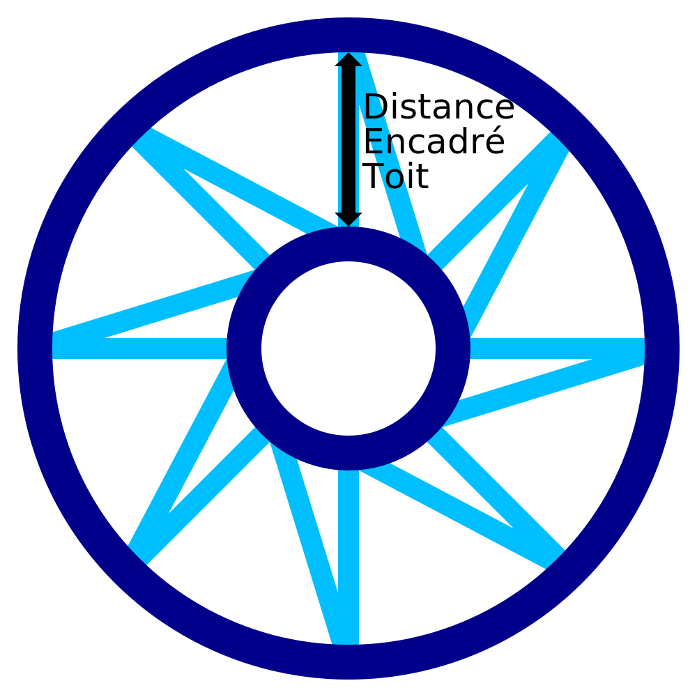

Distance d’insert de toit pour les impressions filaires
====
Lorsque la surface du modèle est horizontale, par exemple la face supérieure du modèle, une série d'anneaux concentriques sera imprimée et reliée à un motif en dents de scie. Ce réglage détermine la distance entre ces anneaux concentriques.

Un motif en dents de scie est dessiné entre chaque encart concentrique. Le motif en dents de scie aura non seulement la hauteur indiquée par ce réglage, mais aussi la largeur de base du motif en dents de scie. La ligne diagonale sera placée à une distance de la base de la ligne droite, comme indiqué par ce réglage sur l'anneau le plus intérieur. Ainsi, ce réglage indique la densité globale du motif du toit, et non pas seulement la distance entre les encastrements.

En réduisant ce réglage, on rapproche les inserts concentriques et on augmente la densité générale du motif. Cela réduit la distance que le matériau doit franchir lorsqu'il passe sur la face supérieure du modèle. Cela améliore la fiabilité et augmente les chances d'établir une connexion correcte entre chaque insert.
