Motif de remplissage
====
Le modèle de remplissage définit une structure qui est utilisée pour remplir le volume de l'objet. Il existe plusieurs modèles, chacun ayant ses propres avantages. Certains sont spécialisés pour des applications très spécifiques.

Grille
----
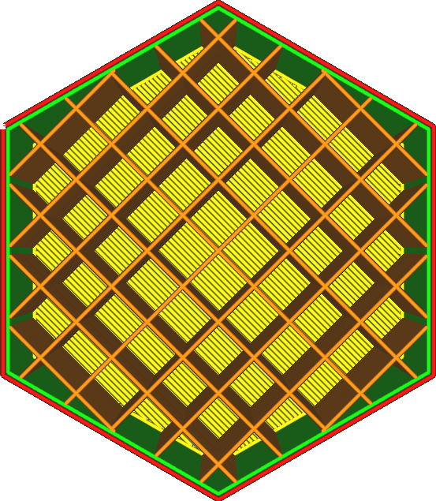

La grille de remplissage crée deux ensembles de lignes perpendiculaires. Ensemble, ils forment un motif de carrés.
* Le motif le plus fort dans la direction verticale.
* Assez fort dans les deux directions des lignes.
* Pas si fort dans la diagonale.
* Très bon support de la surface supérieure. Votre surface aura l'air très lisse.

Lignes
----
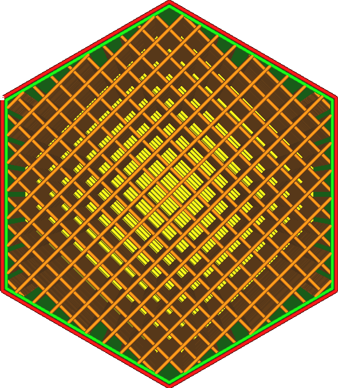

Le motif des lignes crée des lignes parallèles. Par défaut, le motif de lignes alterne sa direction perpendiculairement d'une couche à l'autre, ce qui le fait ressembler au motif de grille à première vue. Cependant, il est possible de modifier cette apparence avec le paramètre [Infill Line Directions](infill_angles.md).
* Le meilleur motif pour une surface supérieure lisse en même temps que le zigzag, puisque la distance entre les lignes est la plus petite.
* Tend à être faible dans la direction verticale, car les couches n'ont que de petits points de liaison entre elles.
* Sera extrêmement faible dans la direction horizontale, sauf dans la seule direction où les lignes sont orientées. Mais même dans cette direction, il n'est pas résistant au cisaillement, de sorte qu'il cède assez rapidement sous la charge.

Triangles
----
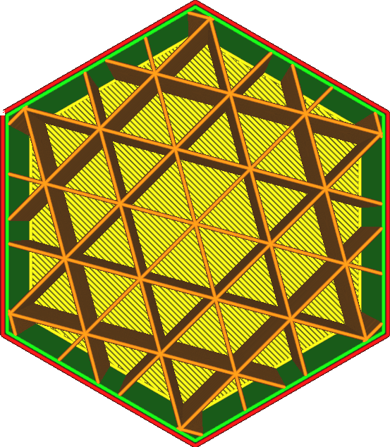

Le motif des triangles crée trois ensembles de lignes dans trois directions différentes. L'ensemble forme un motif de triangles.
* Très résistant au cisaillement.
* La force est à peu près égale dans chaque direction horizontale.
* Les lignes supérieures doivent être assez longues, ce qui nécessite de nombreuses couches de peau pour obtenir une surface supérieure uniforme.
* L'écoulement est considérablement interrompu aux intersections, ce qui entraîne une résistance relativement faible à des taux de remplissage élevés.

Trihexagonal
----
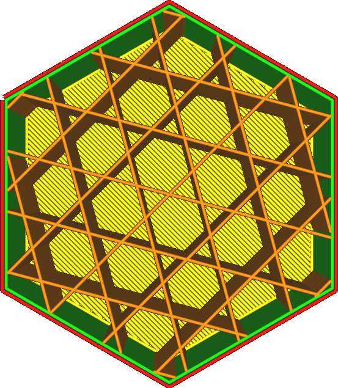

Le modèle tri-hexagone crée trois ensembles de lignes dans trois directions différentes, tout comme le modèle triangulaire, mais décalées les unes par rapport aux autres afin qu'elles ne se croisent pas toutes dans la même position.
* Le motif le plus fort dans la direction horizontale.
* La force est à peu près égale dans toutes les directions horizontales.
* Très résistant au cisaillement.
* Les lignes supérieures doivent être très longues, ce qui nécessite de nombreuses couches de peau supérieures pour obtenir une surface supérieure uniforme.

Cubique
----
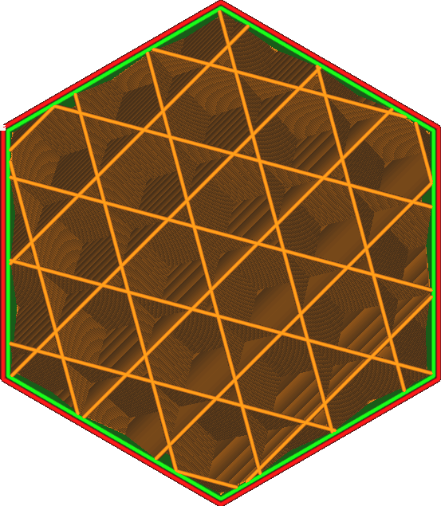

Le motif cubique crée des cubes, un motif tridimensionnel. Les cubes sont orientés debout sur un coin, ce qui permet de les imprimer sans déborder les surfaces internes.
* Force approximativement égale dans toutes les directions, y compris la direction verticale.
* Assez forte dans toutes les directions.
* Effet réduit de l'oreiller, puisqu'il ne produit pas de longues poches verticales d'air chaud.

Subdivision cubique
----
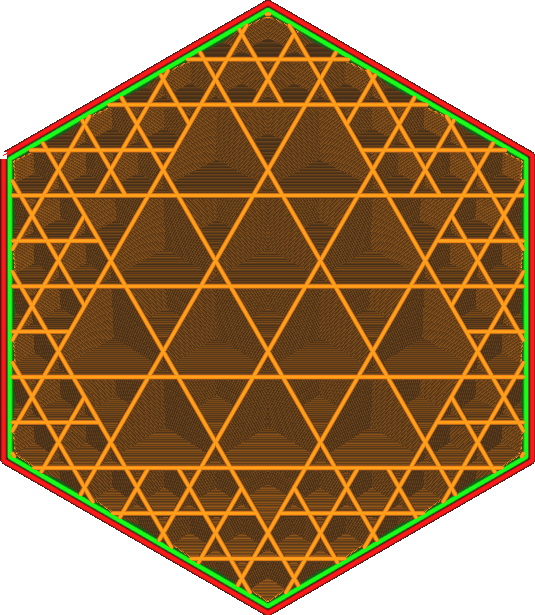

Le modèle de subdivision cubique crée des cubes, un modèle tridimensionnel. Les cubes sont orientés debout sur un coin, ce qui permet de les imprimer sans déborder les surfaces internes. Cependant, ce motif produit des cubes plus grands vers l'intérieur du volume, ce qui permet d'économiser de la matière. Il laisse de côté les lignes de remplissage aux endroits où elles sont les moins utiles.

Ce motif peut produire des densités de remplissage inférieures à celles souhaitées. Il est conseillé d'augmenter considérablement la densité de remplissage lors de l'utilisation de ce modèle. L'optimisation fonctionne mieux à des taux de remplissage élevés.

Algorithmiquement, ce modèle est généré en créant un cube géant autour du volume entier, puis en subdivisant ce cube en 8 sous-cubes lorsqu'il touche une paroi quelconque. Cette opération est ensuite répétée, de sorte que les sous-cubes qui touchent une paroi quelconque sont subdivisés encore et encore. Cela se répète jusqu'à ce que la distance de la ligne de remplissage soit atteinte.
* Le motif le plus fort en fonction du poids et du temps d'impression.
* La force est à peu près égale dans toutes les directions, y compris la direction verticale.
* Concentre le remplissage en fines pièces.
* L'effet de l'oreiller est réduit, car il ne produit pas de longues poches verticales d'air chaud.
* Si l'on utilise une densité de remplissage accrue, le remplissage ne brille pas beaucoup à travers les parois, ce qui produit une meilleure qualité de surface pour un temps d'impression égal.
* Introduit des rétractions, ce qui ne fonctionne pas bien avec des matériaux flexibles ou coulants.
* Prend plus de temps à découper.

Octaédrique
----
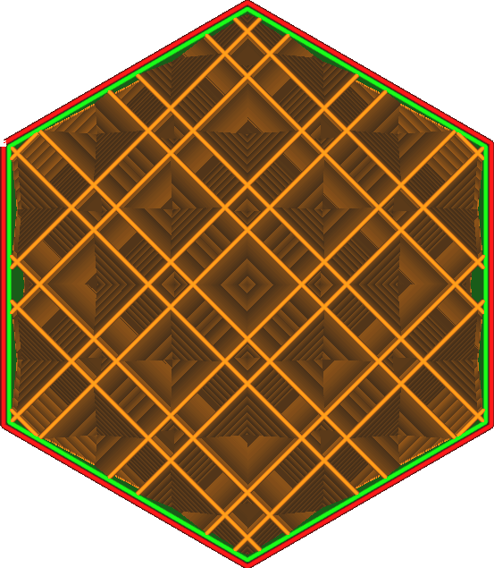

Le motif Octaédrique crée une combinaison de tétraèdres et de cubes réguliers, un motif tridimensionnel. De temps en temps, plusieurs lignes de remplissage sont placées l'une à côté de l'autre.
* Crée un cadre interne solide où plusieurs lignes parallèles se touchent. La charge est rapidement dissipée vers ce cadre interne.
* Fort sur les modèles d'une épaisseur moyenne d'environ un centimètre.
* Effet réduit de l'oreiller, puisqu'il ne produit pas de longues poches verticales d'air chaud.
* Il en résulte une très longue distance de pontage pour la peau supérieure, ce qui réduit la surface supérieure qu

Quart cubique
----
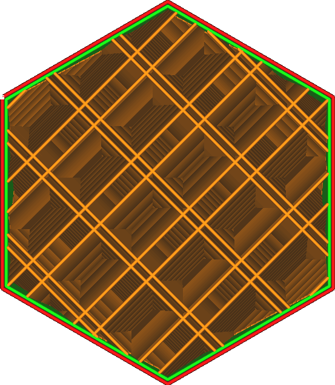

Le motif en Quart cubique crée une tesselation tridimensionnelle composée de tétraèdres et de tétraèdres tronqués. De temps en temps, plusieurs lignes de remplissage sont placées l'une à côté de l'autre.
* Crée deux cadres internes disjoints, semblables à un octet, où de multiples lignes parallèles se touchent. La charge est rapidement dissipée vers ce cadre interne. Les cadres sont orientés dans deux directions différentes, ce qui les rend plus faibles individuellement mais réduit la distance pour répartir la charge sur ces cadres.
* Fort sur les modèles de faible épaisseur de quelques millimètres.
* Effet réduit de l'oreiller, car il ne produit pas de longues poches verticales d'air chaud.
* Résulte en une très longue distance de pontage pour la peau supérieure, ce qui réduit la qualité de la surface supérieure.

Concentrique
----
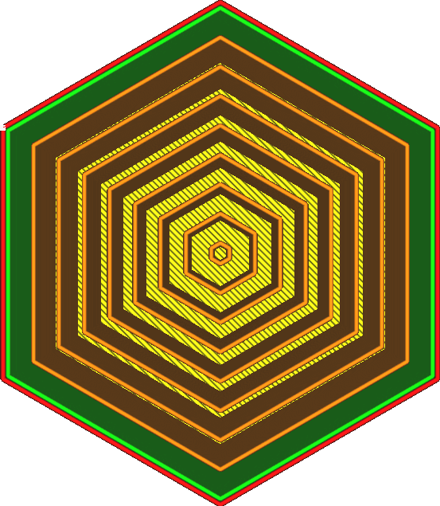

Le motif concentrique crée des anneaux parallèles aux parois.
* Le motif de remplissage le plus fort lorsque l'on utilise un remplissage à 100%, car non seulement aucune ligne ne se croise, mais les lignes sont également orientées de telle sorte que la force non isotrope des lignes répartit la charge.
* Produit les impressions les plus flexibles, avec une force très faible et régulière dans toutes les directions horizontales.
* Plus forte dans la direction verticale que dans la direction horizontale.
* Avec une densité de remplissage de 100 %, le matériau pourrait s'agglutiner au milieu, ce qui réduirait la fiabilité de l'impression de formes rondes où les cercles concentriques se rejoignent en un point.
* Avec certaines formes, certaines des lignes de remplissage pourraient pendre en l'air, n'ajoutant aucune résistance supplémentaire pour le coût du matériau et le temps d'impression.
* Lorsqu'on n'utilise pas un remplissage à 100%, c'est le motif de remplissage le plus faible dans le sens horizontal. Il n'ajoute aucune résistance.

Zigzag
----
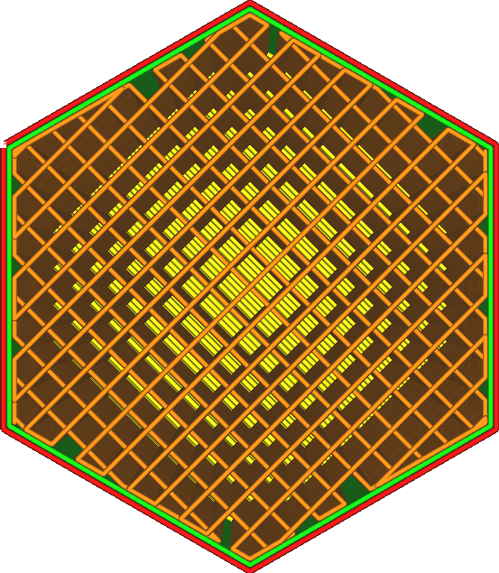

Le motif de remplissage en zigzag fait que la buse dessine des lignes en zigzag. C'est comme des lignes, mais les lignes sont reliées en une longue ligne, ce qui évite les interruptions de débit.
* Le deuxième modèle de remplissage le plus fort est celui qui utilise un remplissage à 100%. Cependant, il est plus fiable que les remplissages concentriques de formes rondes.
* Le meilleur motif pour une surface supérieure lisse avec zigzag, puisque la distance entre les lignes est la plus petite.
* Tend à être assez faible dans le sens vertical, car les couches n'ont que de petits points de liaison entre elles.
* Sera extrêmement faible dans la direction horizontale, sauf dans la seule direction où les lignes sont orientées. Mais même dans cette direction, il n'est pas résistant au cisaillement, de sorte qu'il cède assez rapidement sous la charge. 

Croix
----
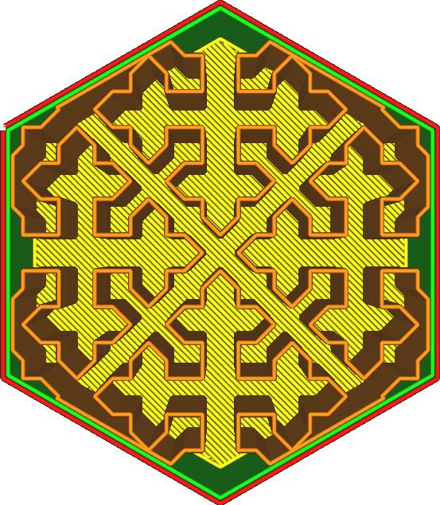

Le modèle de remplissage en croix produit une courbe de remplissage de l'espace qui produit quelque chose qui ressemble à des croix le long de l'intérieur du volume.
* La courbe est uniformément sinueuse dans toutes les directions horizontales, ce qui la rend utile pour imprimer des objets souples et flexibles.
* Ne produit pas de longues lignes droites dans la direction horizontale, ce qui rend ce motif uniformément courbé sur tout le périmètre. Il n'y a pas de points forts.
* Ne produit aucune rétraction, ce qui facilite l'impression avec des matériaux souples.
* Sera plus fort dans le sens vertical que dans le sens horizontal.
* Prend beaucoup de temps à découper.
* Sera très faible dans toutes les directions horizontales.

Croix 3D
----
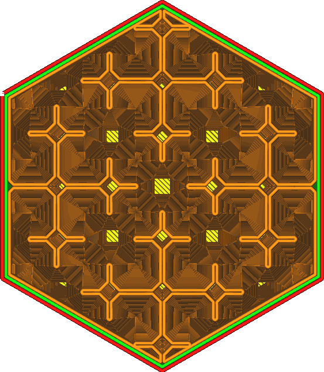

Le modèle de remplissage en 3D croisé produit une courbe de remplissage de l'espace qui produit quelque chose qui ressemble à des croix le long de l'intérieur du volume. Ce motif pulse le long de l'axe Z afin de l'affaiblir dans le sens vertical.
* Ce motif est donc le plus utile pour l'impression d'objets souples et flexibles.
* Il ne produit pas de longues lignes droites, ce qui le rend uniformément sinueux sur toute la surface.
* Ne produit aucune rétraction, ce qui facilite l'impression avec des matériaux souples.
* Prend beaucoup de temps à découper.
* Sera très faible dans toutes les directions. 

Gyroïde
----
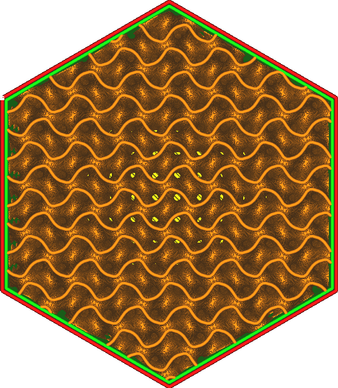

Le motif de remplissage gyroïde produit un motif ondulé qui alterne les directions.
* Produit un volume qui est complètement perméable aux fluides, ce qui en fait un modèle utile pour les matériaux dissolvables.
* Résistance égale dans toutes les directions, mais pas très rigide. Cela le rend utile pour les matériaux flexibles, mais le résultat sera un peu plus dur, moins spongieux, que les motifs de remplissage en croix (3D).
* Il n'y a pas de lignes qui se chevauchent dans ce motif, ce qui permet d'imprimer plus facilement avec des matériaux ayant une tension de surface plus élevée et rend le remplissage très fiable et cohérent.
* Résistant au cisaillement.
* Prend beaucoup de temps à découper et produit de gros fichiers g-code. Pour certaines imprimantes, il peut être difficile de suivre les nombreuses commandes g-code par seconde, et il peut être difficile de suivre une connexion en série à faible débit en bauds.

<!--if cura_version>=4.12-->
Eclair
----
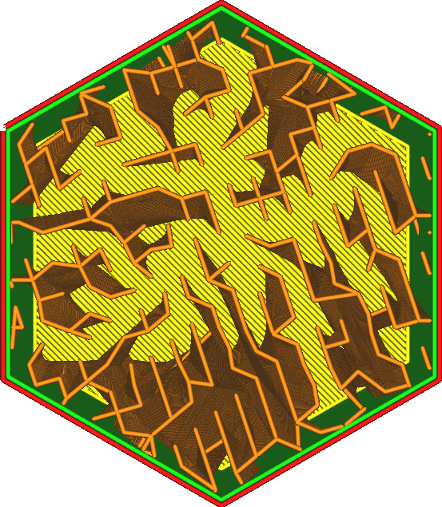
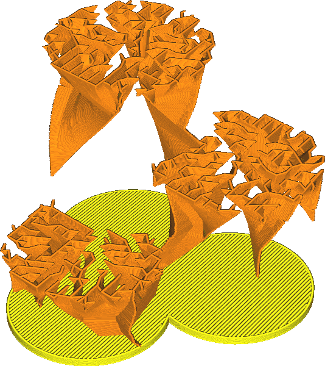

Le motif de remplissage de type éclair est un motif minimal en dents de scie qui vise uniquement à soutenir la surface supérieure. La densité de remplissage spécifiée ne sera atteinte que juste en dessous de la face supérieure du volume de remplissage.
* La densité de remplissage spécifiée ne sera atteinte que sous la face supérieure du volume de remplissage.
* L'augmentation de la densité de remplissage permet d'obtenir la meilleure qualité de surface de tous les motifs, sans nécessiter plus de temps ni de matière.
* Empêche les remplissages de transparaitre à travers les murs à de nombreux endroits, simplement en n'ayant pas de remplissages.
* N'augmente pas la résistance de la pièce de manière significative.
<!--endif-->

<!--if cura_version>=4.14-->
Schwarz P
----

Le motif de remplissage Schwarz P produit un motif ondulé qui alterne les directions. Il est appelé "primitif" parce qu'il comporte deux labyrinthes congruents entrelacés, chacun ayant la forme d'une version tubulaire gonflée du treillis cubique simple. Alors que la surface P standard a une symétrie cubique, la cellule unitaire peut être n'importe quelle boîte rectangulaire, produisant une famille de surfaces minimales avec la même topologie.

Elle peut être approchée par la surface implicite : ***cos(x)+ cos(y)+ cos(z)=0***

* La surface P a été envisagée pour le prototypage avec un rapport surface/volume et une porosité élevés.
* Également résistante dans toutes les directions, mais pas très rigide. Elle est donc utile pour les matériaux flexibles, mais le résultat sera un peu plus dur, moins moelleux, que les motifs de remplissage en croix (3D).
* Il n'y a pas de lignes qui se chevauchent dans ce motif, ce qui permet d'imprimer plus facilement des matériaux ayant une tension de surface plus élevée et rend le remplissage très fiable et cohérent.
* Résistant au cisaillement.
* Le découpage prend beaucoup de temps et produit de gros fichiers de code g. Pour certains imprimeurs, il peut être difficile d'obtenir des résultats satisfaisants. Pour certaines imprimantes, il peut être difficile de suivre les nombreuses commandes de code g par seconde, et il peut être difficile de suivre sur une connexion série à faible vitesse de transmission.

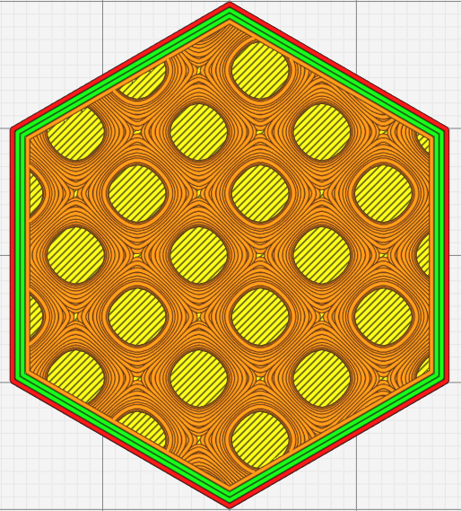

Page Wikipédia sur [Schwarz minimal surface](https://en.wikipedia.org/wiki/Schwarz_minimal_surface).

Schwarz D
----

Le motif de remplissage Schwarz D produit un motif ondulé qui alterne les directions. Il est appelé "diamant" parce qu'il comporte deux labyrinthes congruents entrelacés, chacun ayant la forme d'une version tubulaire gonflée de la structure de liaison du diamant. Dans la littérature, on l'appelle parfois la surface F.

Elle peut être approchée par la surface implicite : ***sin(x)sin(y)sin(z)+sin(x)cos(y)cos(z)+cos(x)sin(y)cos(z)+cos(x)cos(y)sin(z)=0.***

* Également solide dans toutes les directions, mais pas très rigide. Il est donc utile pour les matériaux flexibles, mais le résultat sera un peu plus dur, moins moelleux, que les motifs de remplissage Cross (3D).
* Il n'y a pas de lignes qui se chevauchent dans ce motif, ce qui permet d'imprimer plus facilement des matériaux ayant une tension de surface plus élevée et rend le remplissage très fiable et cohérent.
* Résistant au cisaillement.
* Le découpage prend beaucoup de temps et produit de gros fichiers de code g. Pour certains imprimeurs, il peut être difficile d'obtenir des résultats satisfaisants. Pour certaines imprimantes, il peut être difficile de suivre les nombreuses commandes de code g par seconde, et il peut être difficile de suivre sur une connexion série à faible vitesse de transmission.

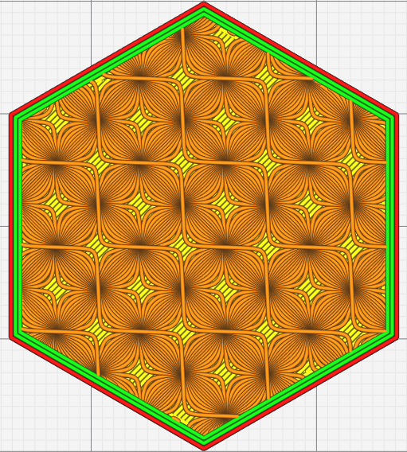

Page Wikipédia sur [Schwarz minimal surface](https://en.wikipedia.org/wiki/Schwarz_minimal_surface).

Courbe de Hilbert
----

Le motif de remplissage Hilbert Curve produit un motif de type Hilbert Curve.

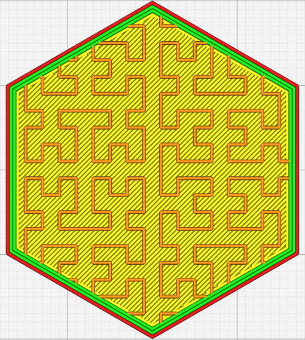

Nid d'abeille
----

Le motif de remplissage Nid d'abeille produit un motif de type Nid d'abeille.

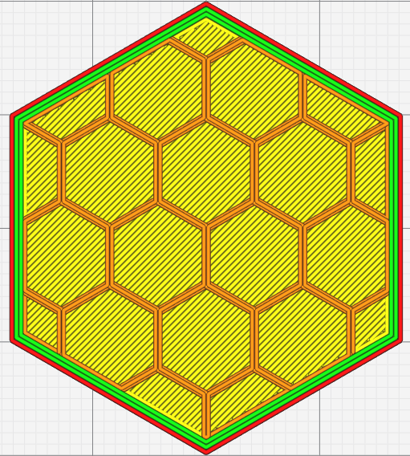

Discrete Lines
----

Ce modèle de remplissage a été demandé par un utilisateur qui a des exigences spécifiques concernant l'emplacement des lignes de remplissage. Il doit pouvoir contrôler explicitement l'emplacement des lignes de remplissage. Pour ce faire, les lignes de remplissage sont spécifiées soit par une chaîne JSON littérale, soit par un fichier contenant un ou plusieurs objets JSON, chaque objet spécifiant les caractéristiques d'une région de remplissage.

Le modèle de remplissage peut être défini à l'aide de la fonction [Discrete Lines Infill Pattern](../mb-master/discrete_lines_infill_definition.md)

<!--endif-->

<!--if cura_version>=4.20-->
Éparses Rectilignes
----

Ce remplissage permet un remplissage aléatoire du modèle dans une direction linéaire, mais qui change d'orientation et d'espacement sur chaque couche. Il en résulte un remplissage qui assure statistiquement la présence de remplissage pour les zones à soutenir, alors que le remplissage régulier risque de ne pas générer de ligne de remplissage sous les zones qui le nécessitent, surtout si la densité de remplissage est faible.

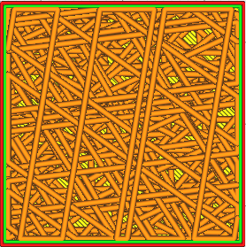
<!--endif-->

<!--if cura_version>=4.20-->
Vague sinusoïdales
----

Le motif de remplissageVague sinusoïdales produit un motif de type Onde sinusoïdale.

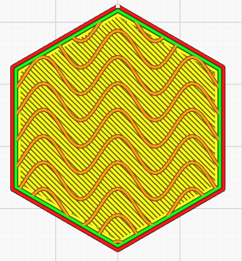
<!--endif-->

<!--if cura_version>=4.20-->
Vague triangulaire
----

Le motif de remplissage Vague triangulaire produit un motif de style Vague triangulaire.

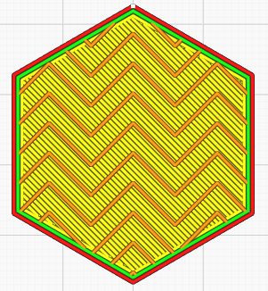
<!--endif-->

