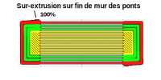

# Bridge Wall End Boost

Cela permet de contrôler l'augmentation du taux d'extrusion immédiatement après la fin d'un mur de pont. L'augmentation du taux d'extrusion peut empêcher la sous-extrusion au début de la ligne suivante.

Le paramètre suivant est défini dans [fdmprinter.def.json](https://github.com/smartavionics/Cura/blob/mb-master/resources/definitions/fdmprinter.def.json) : bridge_wall_end_boost