# Discrete Lines Infill Pattern

Cette nouveautée **_Discrete Lines infill pattern_**  est apparue dans la version 4.20.5. Ce motif de remplissage avait été demandé par un utilisateur qui avait des exigences spécifiques concernant l'emplacement des lignes de remplissage. Ce remplissage permet de contrôler explicitement l'emplacement des lignes de remplissage. Pour ce faire, les lignes de remplissage sont spécifiées soit par une chaîne JSON littérale, soit par un fichier contenant un ou plusieurs objets JSON, chaque objet spécifiant les caractéristiques d'une région de remplissage.

Voici quelques exemples qui illustrent les capacités actuelles...

1 - Tout d'abord, voici l'intérieur d'un modèle qui a été découpé en utilisant le motif de remplissage des lignes discrètes avec une définition vide des lignes discrètes....

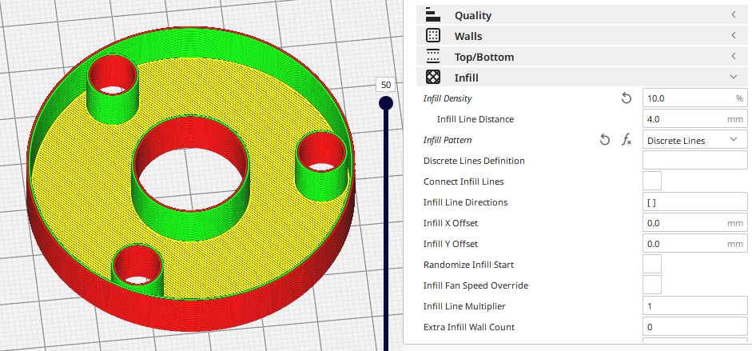

Il n'est pas vraiment surprenant qu'il n'y ait pas de remplissage puisque la définition est vide..

2 - Pour un remplissage très simple qui se répète sur l'ensemble du modèle, vous pouvez définir la définition des lignes discrètes comme suit ***{ "xpitch": 4 }*** (N'oubliez pas qu'il s'agit d'une syntaxe JSON et que vous devez donc entourer la définition de xpitch de { et }). Cela signifie qu'il faut générer des lignes de remplissage tous les 4 mm dans la direction x (et aussi longtemps que nécessaire dans la direction y). Vous obtenez donc ceci...

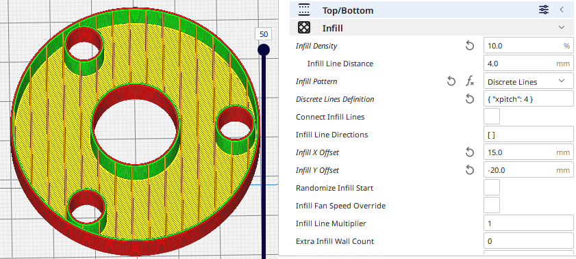

3 - Vous pouvez également fournir plus d'une définition. Ajoutons donc des lignes espacées sur l'axe des y en utilisant la fonction ***{ "xpitch": 4, "ypitch": 10 }***...

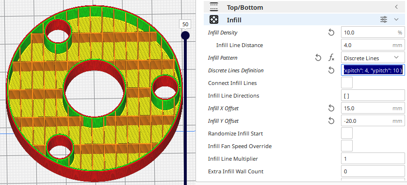

Il est évident que vous ne pouvez pas taper grand-chose dans le petit champ de texte des paramètres, ***vous pouvez fournir les paramètres sous la forme d'un fichier JSON et simplement mettre le nom du fichier dans le champ paramètres préfixé par @*** . 

Le nom du fichier peut être absolu ou relatif au répertoire à partir duquel le fichier de projet a été chargé ou au répertoire personnel de l'utilisateur.

# Exemple de possibilités

Tous les exemples sont maintenant spécifiés sous la forme d'un fichier JSON. Voici un exemple très simple qui introduit le nom de l'option "x". Il s'attend à être suivi d'un tableau de coordonnées x et génère une seule ligne pour chaque coordonnée. Comme on peut s'y attendre, il y a aussi un nom de l'option "y".

`{
 "x": [-18, 0, 15]
 }`

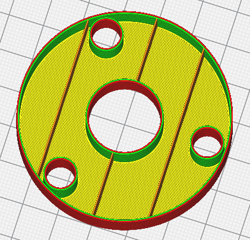

*Cet exemple de code est disponible sur le lien suivant : [J1.json](../../../sample_files/J1.json)*

Par défaut, le remplissage s'adapte au contour du modèle à remplir, mais vous pouvez également spécifier des limites dans les trois dimensions (x, y et z). Ici, nous montrons des lignes répétées qui sont limitées à une région centrale de notre modèle...

`{
 "xpitch": 3,
 "xmin": -15,
 "xmax": 15
}`

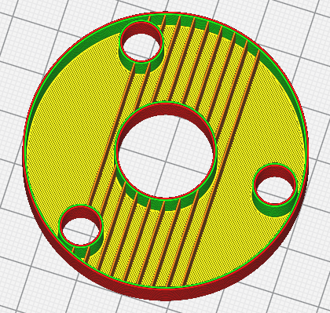

*Cet exemple de code est disponible sur le lien suivant : [J2.json](../../../sample_files/J2.json)*

Nous pouvons également limiter dans la direction y...

`{
 "xpitch": 3,
 "xmin": -15,
 "xmax": 15,
 "ymin": 0
}`

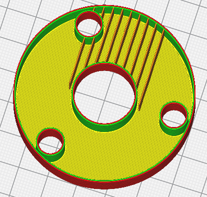

*Cet exemple de code est disponible sur le lien suivant : [J4.json](../../../sample_files/J4.json)*

Le fichier de définition peut contenir non seulement une définition unique, mais aussi un tableau de définitions, qui sont traitées de manière séquentielle. L'exemple suivant montre les lignes x dans la région centrale comme auparavant, mais aussi les lignes y dans les régions extérieures...

`[
 {
 "xpitch": 3,
 "xmin": -15,
 "xmax": 15
 },
 {
 "ypitch": 5
 }
]`

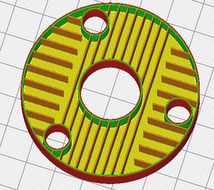

*Cet exemple de code est disponible sur le lien suivant : [J5.json](../../../sample_files/J5.json)*

### Zone de découpe

Vous aurez remarqué que les lignes y sont exclues de la région des lignes x. C'est parce qu'une fois que chaque zone de remplissage a été définie, elle est coupée du modèle. Ce comportement par défaut peut être modifié en réglant "clip" sur False comme suit...

`[
 {
 "clip": false,
 "xpitch": 3,
 "xmin": -15,
 "xmax": 15
 },
 {
"ypitch": 5
 }
]`

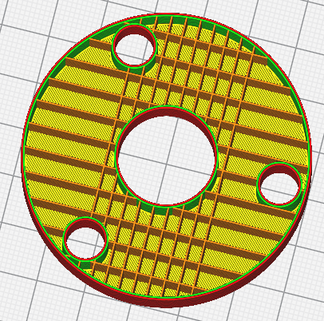

*Cet exemple de code est disponible sur le lien suivant : [J6.json](../../../sample_files/J6.json)*

### enable

Il y a quelques autres membres qui prennent des valeurs booléennes: "enable" and "zigzag".

Paramètre "enable" à false permet d'ignorer la définition en cours, ce qui est utile car on ne peut pas commenter les fichiers JSON et il est donc bon d'avoir un moyen d'activer et de désactiver les définitions individuelles lors de l'expérimentation.

### zigzag

Le fait de définir "zigzag" sur true permet de joindre les extrémités des lignes à l'endroit où elles rencontrent les murs du modèle (tout comme le remplissage en zigzag)...

`[
 {
 "ypitch": 5,
 "zigzag": true
 }
]`

Voici la vue de ce projet, la coque n'étant pas visible...  
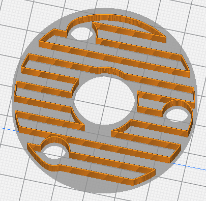

*Cet exemple de code est disponible sur le lien suivant : [J7.json](../../../sample_files/J7.json)*

Enfin, le paramètre "angle" vous permet de spécifier une rotation des lignes...

`[
 {
 "ypitch": 5,
 "angle": 10
 }
]`

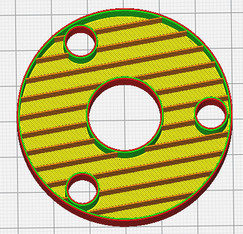

*Cet exemple de code est disponible sur le lien suivant : [J8.json](../../../sample_files/J8.json)*

# Paramètres actuellement disponibles

Dans les descriptions ci-dessous:

- NUM = nombre

- INUM = soit un NUM ou \[NUM, NUM\] dans ce dernier cas, la valeur est interpolée entre les deux valeurs, la première étant utilisée pour la couche la plus basse de la région de remplissage et la seconde pour la couche la plus haute de la région de remplissage.

- BOOLEAN = soit **true** ou **false** (sans citation !) ou un nombre non nul pour vrai et zéro pour faux.

Voici la liste complète des paramètres actuellement disponibles.

- "xpitch": INUM ou "from-settings", "ypitch": INUM ou "from-settings".  
Génère des lignes à la hauteur spécifiée le long des axes x ou y. Le pas peut être spécifié sous la forme NUM ou \[NUM, NUM\] ou la chaîne "from-settings". Si "from-settings" est utilisé, le pas correspond à la valeur du paramètre [Infill Line Distance](../infill/infill_line_distance.md).

- "x": ARRAY_OF_NUM, "y": ARRAY_OF_NUM  
Génère des lignes aux emplacements spécifiés le long des axes x ou y.

- "xmin": NUM, "xmax": NUM, "ymin": NUM, "ymax": NUM, "zmin": NUM, "zmax": NUM  
Limiter la zone de remplissage aux limites spécifiées.

- "rings": INUM ou "from-settings"  
Génère des lignes au pas spécifié sous forme d'anneaux circulaires autour de l'origine du remplissage. Le pas peut être spécifié sous la forme NUM ou \[NUM, NUM\] ou la chaîne "from-settings". Si "from-settings" est utilisé, le pas est la valeur du paramètre [Infill Line Distance](../infill/infill_line_distance.md). Si des "rayons" sont générés, le nombre de segments dans chaque anneau sera le même que le nombre de rayons. Sinon, les anneaux seront lisses.

- "r": ARRAY_OF_NUM  
Génère des lignes aux rayons spécifiés autour de l'origine du remplissage. Si des "rayons" sont générés, le nombre de segments dans chaque anneau sera le même que le nombre de rayons. Sinon, les anneaux seront lisses.

- "rmin": NUM, "rmax": NUM  
Limite la zone de remplissage aux limites radiales spécifiées autour de l'origine du remplissage. Si des "rayons" sont générés, le nombre de segments dans la circonférence de la zone de remplissage sera le même que le nombre de rayons. Sinon, la circonférence de la zone de remplissage sera lisse.

- "spokes": NUM  
Generate NUM equally spaced lines radiating from the infill origin.

- "contours": INUM ou "from-settings"  
Génère des lignes au pas spécifié, insérées dans le contour de la région de remplissage. Le pas peut être spécifié sous la forme NUM ou \[NUM, NUM\] ou la chaîne "from-settings". Si "from-settings" est utilisé, le pas est la valeur du paramètre [Infill Line Distance](../infill/infill_line_distance.md).

- "angle": NUM ou "from-settings"  
Faites pivoter les lignes générées de ce nombre de degrés dans le sens inverse des aiguilles d'une montre. Si "from-settings" est utilisé, l'angle est celui spécifié dans le paramètre [Infill Line Directions](../infill/infill_angles.md) qui, s'il est vide, est par défaut de 45 et 135 degrés.

- "waveform": "sine" ou "triangle" ou "square" ou ARRAY_OF_NUM  
Génère la forme d'onde spécifiée au lieu d'une ligne droite. L'amplitude et la longueur d'onde de la forme d'onde sont spécifiées séparément. Les formes d'onde peuvent également être spécifiées sous la forme d'un tableau de nombres qui fournissent l'amplitude de l'onde à des intervalles régulièrement espacés dans une longueur d'onde unique. Chaque élément du tableau est une valeur d'échelle d'amplitude et doit être compris entre -1 et 1.

- "wavelength": INUM  
La longueur d'onde de la forme d'onde.

- "amplitude": INUM  
L'amplitude zéro de la forme d'onde.

- "clip": BOOLEAN  
Indique si la région de remplissage actuelle est coupée de la zone du modèle afin que les définitions suivantes ne s'appliquent pas à la même zone. La valeur par défaut est true.

- "enable": BOOLEAN  
Indique si la définition actuelle est utilisée ou non. La valeur par défaut est true.

- "zigzag": BOOLEAN  
Indique si les extrémités des lignes de remplissage qui rejoignent le contour du modèle sont connectées (comme le remplissage en zigzag) ou non. La valeur par défaut est celle du paramètre [Relier les lignes de remplissage](../infill/zig_zaggify_infill.md).

- "scattered": BOOLEAN  
Indiquer s'il faut ou non générer un motif de remplissage dispersé. Le motif de remplissage dispersé génère des lignes dont l'espacement et la direction sont aléatoires sur chaque couche. Suppose que le motif des lignes de remplissage est soit le motif par défaut, soit le motif par défaut : '\[ \]' ou deux valeurs à 90 degrés l'une de l'autre.

## Notes

Toutes les longueurs sont en mm.

Les coordonnées x et y sont relatives à l'origine du remplissage qui est le milieu de la maille remplie avec un décalage par les paramètres Infill X/Y Offset..

Les coordonnées z sont relatives au plateau d'impression.

# Facilité d'utilisation

L'un des problèmes de JSON est qu'il ne pardonne pas en termes de syntaxe. Si vous oubliez une virgule ou une parenthèse, ou si vous en avez trop, la définition ne sera pas lue et vous n'obtiendrez pas de remplissage.

Pire encore, les rapports d'erreur sont actuellement très primitifs. Si le fichier de définition ne peut pas être lu ou s'il contient des erreurs de syntaxe, vous obtiendrez un message dans le fichier cura.log. Ainsi, par exemple, le mauvais fichier JSON suivant (il manque une virgule) générera l'erreur ci-dessous...

`[
 {
 "ypitch": 5
 "angle": 10
 }
]`

 ***2022-09-16 14:03:02,901 - DEBUG - [EngineErrorThread] UM.Backend.Backend._backendLog [110]: [Backend] [ERROR] DiscreteLinesInfill: Error parsing JSON (offset 28): Missing a comma or '}' after an object member.***

Malheureusement, il n'existe actuellement aucun mécanisme dans Cura permettant d'afficher dans l'interface utilisateur un message d'erreur généré dans le moteur qui effectue le découpage.

## Remplissage Décalage X et Y

Les [décalages X](../infill/infill_offset_x.md) et [Y](../infill/infill_offset_y.md) du remplissage sont toujours actifs avec ce mode. Voici donc un exemple où les lignes de remplissage devraient se croiser au milieu du modèle mais où le remplissage a été décalé...

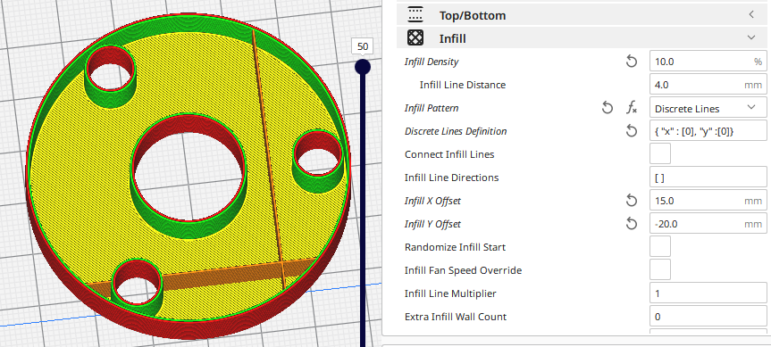

# "xpitch" and "ypitch" member

Dernier ajout : les valeurs "xpitch" et "ypitch" peuvent être un seul nombre, auquel cas la même valeur de hauteur est utilisée pour toutes les couches de la région de remplissage actuelle. Vous pouvez également spécifier un tableau de deux éléments, le premier étant la valeur de hauteur de la couche la plus basse de la région et le second la valeur de hauteur de la couche la plus haute de la région ; pour les couches intermédiaires, la valeur de hauteur est interpolée entre ces deux limites. Il est évident que la pente ne peut pas être trop faible, sinon le remplissage ne sera pas supporté par les couches inférieures. Voici un exemple qui définit trois régions de remplissage, une région inférieure à 4 mm, une région de 4 mm à 15 mm et une dernière région supérieure à 25 mm. La région la plus basse a un pas de 10, la région la plus haute a un pas de 8 et la région du milieu a un pas qui passe de 10 à 8 au fur et à mesure que z augmente.

`[
 {
 "xpitch": 10,
 "zmax": 4
 },
 {
 "xpitch": [10,8],
 "zmax": 15,
 "zmin": 4
 },
 {
 "xpitch": 8
 }
]`

Et voici ce que vous obtenez (sans la coque pour plus de clarté)...

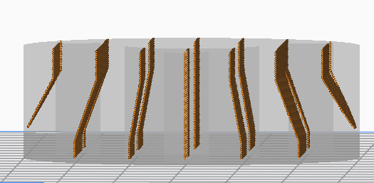

*Cet exemple de code est disponible sur le lien suivant : [J10.json](../../../sample_files/J10.json)*

## Densité de remplissage variable

Voici un autre exemple montrant que la densité de remplissage passe de 10 % en bas du modèle à près de 100 % en haut...

`[
 {
 "xpitch": [10, 0.4],
 "ypitch": [10, 0.4]
 }
]`

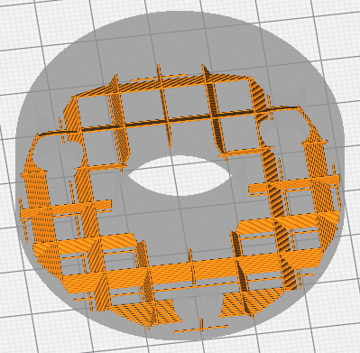 
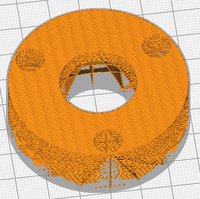

*Cet exemple de code est disponible sur le lien suivant : [J11.json](../../../sample_files/J11.json)*

# Génération de formes d'onde

Si le remplissage en ligne droite est trop ennuyeux, vous pouvez également utiliser des lignes ondulées...

`[
{
"xpitch": 5,
"waveform": "sine"
"wavelength": 10,
"amplitude": 5,
"zigzag": true
}
]`

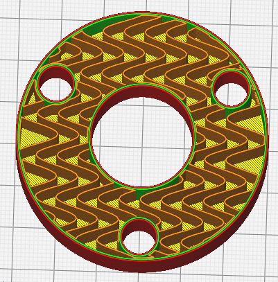

*Cet exemple de code est disponible sur le lien suivant : [J12.json](../../../sample_files/J12.json)*

La forme d'onde peut être spécifiée sous la forme d'un tableau d'amplitudes (entre -1 et 1) comme suit...

`[
 {
 "xpitch": 5,
 "waveform": [0.25, 1.0, 0.25, 0.0, -0.25, -1.0, -0.25, 0.0],
 "wavelength": 8,
 "amplitude": 2,
 "zigzag": true
 }
]`

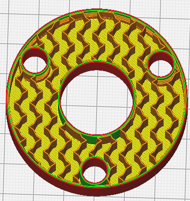

*Cet exemple de code est disponible sur le lien suivant : [J13.json](../../../sample_files/J13.json)*

Enfin, comme l'amplitude et la longueur d'onde de la forme d'onde peuvent varier en fonction de la hauteur de la couche, il est possible d'obtenir des résultats farfelus, comme dans cet exemple où l'amplitude de l'onde sinusoïdale passe de 0 à 5.

`[
 {
 "xpitch": 5,
 "waveform": "sine",
 "wavelength": 10,
 "amplitude": [0, 5]
 }
]`

Voici une vue de dessous sans les zigzags ni la coquille...

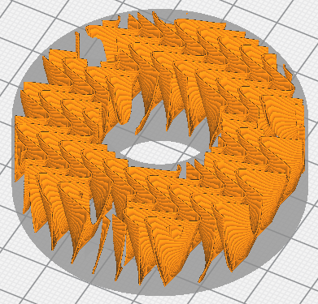

*Cet exemple de code est disponible sur le lien suivant : [J14.json](../../../sample_files/J14.json)*

Il y a donc des lignes (presque) droites en bas et des ondes sinusoïdales en haut.

## Forme d'onde ondes carrées

Le mécanisme décrit ci-dessus pour spécifier la forme d'une onde présente un inconvénient majeur : il ne permet pas de créer des ondes dont les temps de montée et de descente sont nuls, comme les ondes carrées. Une onde carrée peut être décrite à l'aide de 4 amplitudes, comme dans l'exemple suivant

`[
 {
 "ypitch": 5,
 "waveform": [-1, 1, 1, -1],
 "wavelength": 8,
 "amplitude": 2,
 "zigzag": true
 }
]`

Mais cela produit des lignes inclinées entre les parties horizontales de la forme d'onde, comme vous pouvez le voir ici...

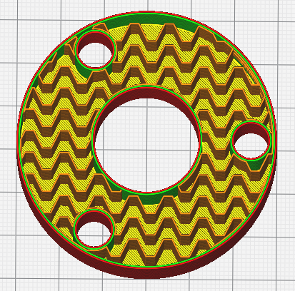

*Cet exemple de code est disponible sur le lien suivant : [J15.json](../../../sample_files/J15.json)*

Si vous souhaitez spécifier qu'une transition ne doit pas prendre de temps. Le schéma actuel consiste à marquer les changements de valeur d'amplitude qui doivent se produire "instantanément" à l'aide d'une chaîne de caractères dans le tableau, de sorte que l'exemple ci-dessus ressemblerait à ce qui suit:

`[
 {
 "ypitch": 5,
 "waveform": [-1, "", 1, 1, "", -1],
 "wavelength": 8,
 "amplitude": 2,
 "zigzag": true
 }
]`

Les valeurs "" indiquent que les transitions de -1 à 1 et de 1 à -1 ne doivent pas prendre de temps. Et maintenant, nous obtenons...

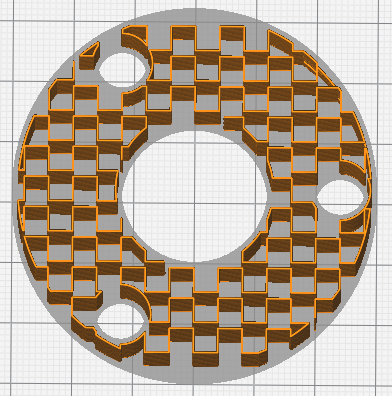

*Cet exemple de code est disponible sur le lien suivant : [J16.json](../../../sample_files/J16.json)*

### Exemple de code de forme d'onde

Je ne sais pas si j'utiliserai un jour un motif comme celui-ci... Mais vous trouverez un exemple de code de forme d'onde,

`[
 {
 "clip": false,
 "ypitch": 10,
 "waveform": [1.0, 0.25, 0.0, 0.0, -0.25, -1.0,-1.0,"",1.0],
 "wavelength": 10,
 "amplitude": [3,5],
 "zmax": 10,
 "zigzag": true
 },
 {
 "clip": false,
 "ypitch": 10,
 "waveform": [1.0, 0.25, 0.0, 0.0, -0.25, -1.0,-1.0,"",1.0],
 "wavelength": 10,
 "amplitude": 5,
 "zmin": 10,
 "zigzag": true
 }
]`

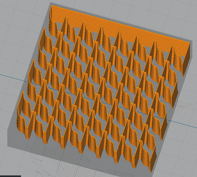

*Cet exemple de code est disponible sur le lien suivant : [J17.json](../../../sample_files/J17.json)*

### 5axes

Je ne le pense pas... mais au fait, il y a quelque chose d'étrange concernant l'utilisation du guillemet double dans la définition de la forme d'onde. Si vous l'utilisez seul à la fin de la séquence, le comportement est différent.

`"waveform": [1.0, 0.25, 0.0, 0.0, -0.25, -1.0,-1.0,"",1.0],`

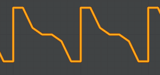

`"waveform": [1.0, 1.0, 0.25, 0.0, 0.0, -0.25, -1.0,-1.0,""],`

Or

`"waveform": ["", 1.0, 1.0, 0.25, 0.0, 0.0, -0.25, -1.0,-1.0],`

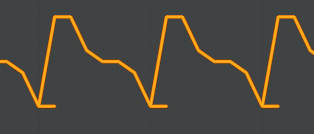

Si vous abusez aussi des guillemets doubles, vous risquez d'avoir un comportement étrange (mais intéressant) :

`"waveform": ["","","","",1.0,1.0, 0.25, 0.0, 0.0, -0.25, -1.0,-1.0],`

# Paramètre "scattered"

"scattered" a été ajouté, il est simple à utiliser...

`[
 {
 "ypitch": "from-settings",
 "scattered": true
 }
]`

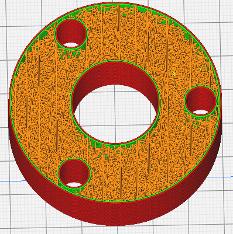

*Cet exemple de code est disponible sur le lien suivant : [J19.json](../../../sample_files/J19.json)*

Avec le pas de l'utilisateur spécifié.

`[
 {
 "ypitch": 3,
 "scattered": true
 }
]`

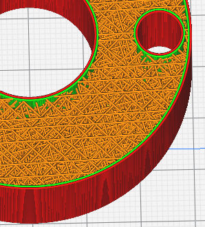

*Cet exemple de code est disponible sur le lien suivant : [J20.json](../../../sample_files/J20.json)*

## Exemple de code épars

`[
 {
 "ypitch": 3,
 "ymax": 0,
 "ymin": -20,
 "xmin": -15,
 "xmax": 10,
 "scattered": true
 },
 {
 "xpitch": "from-settings",
 "waveform": "triangle",
 "wavelength": 8,
 "zigzag": 1,
 "amplitude": 2
 }
]`

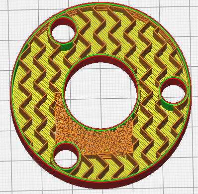

*Cet exemple de code est disponible sur le lien suivant : [J21.json](../../../sample_files/J21.json)*

# Paramètres "rings" et "spokes"

Nous avons ensuite les "anneaux (rings)" et les "rayons (spokes)" qui vous permettent de créer des remplissages en forme de toile d'araignée...

`[
 {
 "rings": "from-settings",
 "spokes": 20
 }
]`

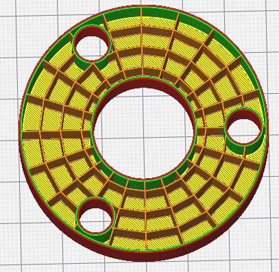

*Cet exemple de code est disponible sur le lien suivant : [J22.json](../../../sample_files/J22.json)*

## Décaler le remplissage

L'aspect de la toile d'araignée est encore plus marqué si l'on décale le remplissage...

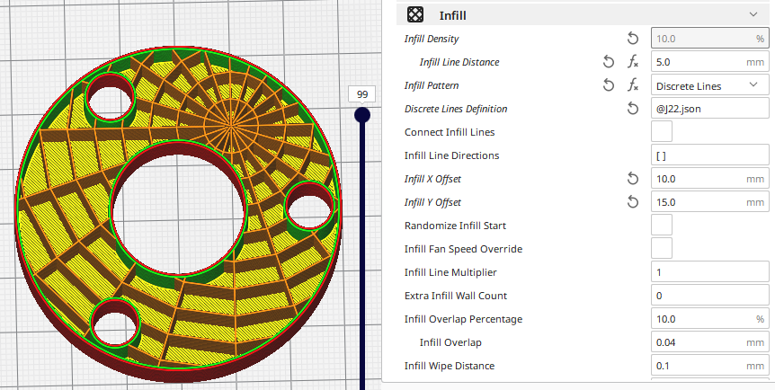

Remarquez que la densité des rayons diminue à l'origine.

# Paramètre r 

Le paramètre "r" vous permet de spécifier des rayons individuels pour des anneaux comme celui-ci...

`[
 {
 "r": [ 17, 20 ],
 "spokes": 20
 }
]`

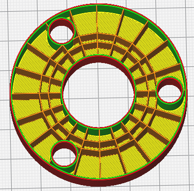

*Cet exemple de code est disponible sur le lien suivant : [J23.json](../../../sample_files/J23.json)*

# Paramètre rmin & rmax

"rmin" et "rmax" vous permettent de spécifier les rayons min et max de la région à remplir. Dans cet exemple, le remplissage dispersé est limité à une distance comprise entre 15 et 20 mm de l'origine du remplissage et tout le reste reçoit la forme d'onde triangulaire...

`[
 {
 "ypitch": "from-settings",
 "rmax": 20,
 "rmin": 15,
 "scattered": true
 },
 {
 "xpitch": "from-settings",
 "waveform": "triangle",
 "wavelength": 8,
 "amplitude": 2
 }
]`

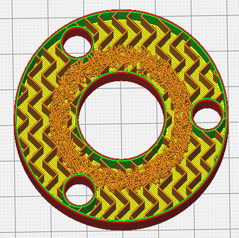

*Cet exemple de code est disponible sur le lien suivant : [J24.json](../../../sample_files/J24.json)*

# Paramètre de Contours

Et puis il y a les "contours"...

`[
 {
 "contours": "from-settings"
 }
]`

Cette image utilise une densité de remplissage de 20 %, alors que les exemples précédents utilisaient une densité de 10 %.

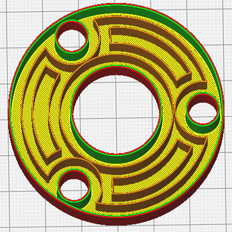

*Cet exemple de code est disponible sur le lien suivant : [J25.json](../../../sample_files/J25.json)*

Le paramètre suivant est défini dans [fdmprinter.def.json](https://github.com/smartavionics/Cura/blob/mb-master/resources/definitions/fdmprinter.def.json) : discrete_lines_infill_definition