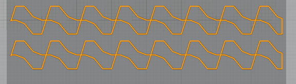

# Discrete Lines Infill Pattern

Cette expérience **_Discrete Lines infill pattern_**  est apparu dans la version 4.20.5. Ce motif de remplissage a été demandé par un utilisateur qui a des exigences spécifiques concernant l'emplacement des lignes de remplissage. Il doit pouvoir contrôler explicitement l'emplacement des lignes de remplissage. Pour ce faire, les lignes de remplissage sont spécifiées soit par une chaîne JSON littérale, soit par un fichier contenant un ou plusieurs objets JSON, chaque objet spécifiant les caractéristiques d'une région de remplissage.

Voici quelques exemples qui illustrent les capacités actuelles...

1 - Tout d'abord, voici l'intérieur d'un modèle qui a été découpé en utilisant le motif de remplissage des lignes discrètes avec une définition vide des lignes discrètes....

Il n'est pas vraiment surprenant qu'il n'y ait pas de remplissage puisque la définition est vide..

2 - Pour un remplissage très simple qui se répète sur l'ensemble du modèle, vous pouvez définir la définition des lignes discrètes comme suit ***{ "xpitch": 4 }*** (N'oubliez pas qu'il s'agit d'une syntaxe JSON et que vous devez donc entourer la définition de xpitch de { et }). Cela signifie qu'il faut générer des lignes de remplissage tous les 4 mm dans la direction x (et aussi longtemps que nécessaire dans la direction y). Vous obtenez donc ceci...

3 - Vous pouvez également fournir plus d'une définition. Ajoutons donc des lignes espacées sur l'axe des y en utilisant la fonction ***{ "xpitch": 4, "ypitch": 10 }***...

Il est évident que vous ne pouvez pas taper grand-chose dans le petit champ de texte des paramètres, ***vous pouvez fournir les paramètres sous la forme d'un fichier JSON et simplement mettre le nom du fichier dans le champ paramètres préfixé par @*** . Le nom du fichier peut être absolu ou relatif au répertoire à partir duquel le fichier de projet a été chargé ou au répertoire personnel de l'utilisateur.

# Exemple de capacités

Tous les exemples sont maintenant spécifiés sous la forme d'un fichier JSON. Voici un exemple très simple qui introduit le nom de l'option "x". Il s'attend à être suivi d'un tableau de coordonnées x et génère une seule ligne pour chaque coordonnée. Comme on peut s'y attendre, il y a aussi un nom de l'option "y".

`{
 "x": [-18, 0, 15]
 }`

*Cet exemple de code est disponible sur le lien suivant : [J1.json](../../sample_files/J1.json)*

Par défaut, le remplissage s'adapte au contour du modèle à remplir, mais vous pouvez également spécifier des limites dans les trois dimensions (x, y et z). Ici, nous montrons des lignes répétées qui sont limitées à une région centrale de notre modèle...

`{
 "xpitch": 3,
 "xmin": -15,
 "xmax": 15
}`

*Cet exemple de code est disponible sur le lien suivant : [J2.json](../../sample_files/J2.json)*

Nous pouvons également limiter dans la direction y...

`{
 "xpitch": 3,
 "xmin": -15,
 "xmax": 15,
 "ymin": 0
}`

*Cet exemple de code est disponible sur le lien suivant : [J4.json](../../sample_files/J4.json)*

Le fichier de définition peut contenir non seulement une définition unique, mais aussi un tableau de définitions, qui sont traitées de manière séquentielle. L'exemple suivant montre les lignes x dans la région centrale comme auparavant, mais aussi les lignes y dans les régions extérieures...

`[
 {
 "xpitch": 3,
 "xmin": -15,
 "xmax": 15
 },
 {
 "ypitch": 5
 }
]`

*Cet exemple de code est disponible sur le lien suivant : [J5.json](../../sample_files/J5.json)*

### Zone de découpe

Vous aurez remarqué que les lignes y sont exclues de la région des lignes x. C'est parce qu'une fois que chaque zone de remplissage a été définie, elle est coupée du modèle. Ce comportement par défaut peut être modifié en réglant "clip" sur False comme suit...

`[
 {
 "clip": false,
 "xpitch": 3,
 "xmin": -15,
 "xmax": 15
 },
 {
"ypitch": 5
 }
]`

*Cet exemple de code est disponible sur le lien suivant : [J6.json](../../sample_files/J6.json)*

### enable

Il y a quelques autres membres qui prennent des valeurs booléennes: "enable" and "zigzag".

Paramètre "enable" à false permet d'ignorer la définition en cours, ce qui est utile car on ne peut pas commenter les fichiers JSON et il est donc bon d'avoir un moyen d'activer et de désactiver les définitions individuelles lors de l'expérimentation.

### zigzag

Le fait de définir "zigzag" sur true permet de joindre les extrémités des lignes à l'endroit où elles rencontrent les murs du modèle (tout comme le remplissage en zigzag)...

`[
 {
 "ypitch": 5,
 "zigzag": true
 }
]`

Voici la vue de ce projet, la coque n'étant pas visible...  

*Cet exemple de code est disponible sur le lien suivant : [J7.json](../../sample_files/J7.json)*

Enfin, le paramètre "angle" vous permet de spécifier une rotation des lignes...

`[
 {
 "ypitch": 5,
 "angle": 10
 }
]`

*Cet exemple de code est disponible sur le lien suivant : [J8.json](../../sample_files/J8.json)*

# Paramètres actuellement disponibles

Dans les descriptions ci-dessous:

- NUM = nombre

- INUM = soit un NUM ou \[NUM, NUM\] dans ce dernier cas, la valeur est interpolée entre les deux valeurs, la première étant utilisée pour la couche la plus basse de la région de remplissage et la seconde pour la couche la plus haute de la région de remplissage.

- BOOLEAN = soit **true** ou **false** (sans citation !) ou un nombre non nul pour vrai et zéro pour faux.

Voici la liste complète des paramètres actuellement disponibles.

- "xpitch": INUM or "from-settings", "ypitch": INUM or "from-settings".  
Generate lines at the specified pitch along either the x or y axes. The pitch can be specified as NUM or \[NUM, NUM\] or the string "from-settings". If "from-settings" is used, the pitch is the value of the Infill Line Distance setting.

- "x": ARRAY_OF_NUM, "y": ARRAY_OF_NUM  
Generate lines at the specified locations along either the x or y axes.

- "xmin": NUM, "xmax": NUM, "ymin": NUM, "ymax": NUM, "zmin": NUM, "zmax": NUM  
Limit the infill area to the specified limits.

- "rings": INUM or "from-settings"  
Generate lines at the specified pitch as circular rings around the infill origin. The pitch can be specified as NUM or \[NUM, NUM\] or the string "from-settings". If "from-settings" is used, the pitch is the value of the Infill Line Distance setting. If "spokes" are being generated, the number of segments in each ring will be the same as the number of spokes. Otherwise the rings will be smooth.

- "r": ARRAY_OF_NUM  
Generate lines at the specified radii around the infill origin. If "spokes" are being generated, the number of segments in each ring will be the same as the number of spokes. Otherwise the rings will be smooth.

- "rmin": NUM, "rmax": NUM  
Limit the infill area to the specified radial limits around the infill origin. If "spokes" are being generated, the number of segments in the circumference of the infill area will be the same as the number of spokes. Otherwise the circumference of the infill area will be smooth.

- "spokes": NUM  
Generate NUM equally spaced lines radiating from the infill origin.

- "contours": INUM or "from-settings"  
Generate lines at the specified pitch inset from the infill region's outline. The pitch can be specified as NUM or \[NUM, NUM\] or the string "from-settings". If "from-settings" is used, the pitch is the value of the Infill Line Distance setting.

- "angle": NUM or "from-settings"  
Rotate the generated lines this number of degrees anti-clockwise. If "from-settings" is used, the angle is as specified in the Infill Line Directions setting which, if empty, defaults to 45 and 135 degrees.

- "waveform": "sine" or "triangle" or "square" or ARRAY_OF_NUM  
Generate the specified waveform instead of a straight line. The amplitude and wavelength of the waveform are specified separately. Waveforms can also be specified as an array of numbers that provide the amplitude of the wave at regularly spaced intervals within a single wavelength. Each element in the array is an amplitude scaling value and should be in the range -1 to 1.

- "wavelength": INUM  
The wavelength of the waveform.

- "amplitude": INUM  
The zero-peak amplitude of the waveform.

- "clip": BOOLEAN  
Specify whether the current infill region is clipped from the model area so subsequent definitions don't apply to the same area. Defaults to true.

- "enable": BOOLEAN  
Specify whether the current definition is used or not. Defaults to true.

- "zigzag": BOOLEAN  
Specify whether the ends of the infill lines that meet the model outline are connected (like zigzag pattern infill) or not. Defaults to the value of the Connect Infill Lines setting.

- "scattered": BOOLEAN  
Specify whether to generate a scattered infill pattern or not. The scattered infill pattern generates lines with randomised spacing and direction on each layer. Assumes that the Infill Line Pattern is either the default '\[ \]' or set to two values 90 degrees apart.

## Notes

All lengths are in mm.

The x and y coordinates are relative to the infill origin which is the middle of the mesh being filled with offset by the Infill X/Y Offset settings.

The z coordinates are relative to the buildplate.

# Usability

One problem with JSON is that it is very unforgiving in terms of syntax. If you miss out a comma or bracket, or have too many, it will fail to read the definition and you won't get any infill generated.

Worse still, the error reporting is currently very primitive. If the definition file cannot be read or it contains syntax errors you will get a message in the cura.log file. So, for example, the following bad JSON file (it's missing a comma) will generate the error below...

`[
 {
 "ypitch": 5
 "angle": 10
 }
]`

 ***2022-09-16 14:03:02,901 - DEBUG - [EngineErrorThread] UM.Backend.Backend._backendLog [110]: [Backend] [ERROR] DiscreteLinesInfill: Error parsing JSON (offset 28): Missing a comma or '}' after an object member.***

Unfortunately, there's currently no mechanism in Cura to get an error message generated in the engine that does the slicing back to be displayed in the UI.

## infill X and Y Offset

The infill X and Y offsets are still active with this mode so here is an example where the infill lines should cross at the middle of the model but the infill has been shifted...

# "xpitch" and "ypitch" member

Latest addition: the "xpitch" and "ypitch" values can either be a single number, in which case, the same pitch value is used for all the layers in the current infill region. Alternatively, you can specify a two element array and the first element is the pitch value for the lowest layer in the region and the second element is the pitch value for the topmost layer in the region and for the layers between, the pitch value is interpolated between those two limits. Obviously, the gradient can't be too shallow otherwise the infill won't be supported by the layers below. Anyway. here's an example that defines three infill regions, a region that is below 4mm, a region from 4mm up to 15mm and the last region that is above 25mm. The lowest region has a pitch of 10, the highest region has a pitch of 8 and the middle region has a pitch that goes from 10 to 8 as z increases.

`[
 {
 "xpitch": 10,
 "zmax": 4
 },
 {
 "xpitch": [10,8],
 "zmax": 15,
 "zmin": 4
 },
 {
 "xpitch": 8
 }
]`

And this is what you get (sans shell for clarity)...

*Cet exemple de code est disponible sur le lien suivant : [J10.json](../../sample_files/J10.json)*

## Variable picth density

Here's another example showing the infill density going from 10% at the bottom of the model to close to 100% at the top...

`[
 {
 "xpitch": [10, 0.4],
 "ypitch": [10, 0.4]
 }
]`

 

*Cet exemple de code est disponible sur le lien suivant : [J11.json](../../sample_files/J11.json)*

# Waveform generation

If straight line infill is too boring, you can also have wiggly lines...

`[
{
"xpitch": 5,
"waveform": "sine"
"wavelength": 10,
"amplitude": 5,
"zigzag": true
}
]`

*Cet exemple de code est disponible sur le lien suivant : [J12.json](../../sample_files/J12.json)*

The waveform shape can be specified as an array of amplitudes (between -1 and 1) like this...

`[
 {
 "xpitch": 5,
 "waveform": [0.25, 1.0, 0.25, 0.0, -0.25, -1.0, -0.25, 0.0],
 "wavelength": 8,
 "amplitude": 2,
 "zigzag": true
 }
]`

*Cet exemple de code est disponible sur le lien suivant : [J13.json](../../sample_files/J13.json)*

Finally, because the waveform amplitude and wavelength can be varied with layer height you can achieve wacky stuff like this example where the sine wave amplitude goes from 0 to 5.

`[
 {
 "xpitch": 5,
 "waveform": "sine",
 "wavelength": 10,
 "amplitude": [0, 5]
 }
]`

Here's a bottom view of that without the zigzags or shell...

*Cet exemple de code est disponible sur le lien suivant : [J14.json](../../sample_files/J14.json)*

So there's (almost) straight lines at the bottom and sine waves at the top.

## Waveform square waves

The above described mechanism for specifying the shape of a waveform has a major drawback in that it doesn't allow the creation of waveforms that have zero rise and fall times, e.g. square waves. A square wave could be described using 4 amplitudes like this example

`[
 {
 "ypitch": 5,
 "waveform": [-1, 1, 1, -1],
 "wavelength": 8,
 "amplitude": 2,
 "zigzag": true
 }
]`

But that produces sloped lines between the horizontal portions of the waveform, as you can see here...

*Cet exemple de code est disponible sur le lien suivant : [J15.json](../../sample_files/J15.json)*

I you want to specify that a transition should take zero time. The current scheme is to mark amplitude value changes that should occur "instantaneously" with a string element in the array, so the above example would now look like:

`[
 {
 "ypitch": 5,
 "waveform": [-1, "", 1, 1, "", -1],
 "wavelength": 8,
 "amplitude": 2,
 "zigzag": true
 }
]`

The "" elements are indicating that the transitions from -1 to 1 and 1 to -1 should take zero time. And now we get...

*Cet exemple de code est disponible sur le lien suivant : [J16.json](../../sample_files/J16.json)*

### Sample waveform code

Don't know if i will ever use a motif like this one.. But you will find some sample waveform code ,

`[
 {
 "clip": false,
 "ypitch": 10,
 "waveform": [1.0, 0.25, 0.0, 0.0, -0.25, -1.0,-1.0,"",1.0],
 "wavelength": 10,
 "amplitude": [3,5],
 "zmax": 10,
 "zigzag": true
 },
 {
 "clip": false,
 "ypitch": 10,
 "waveform": [1.0, 0.25, 0.0, 0.0, -0.25, -1.0,-1.0,"",1.0],
 "wavelength": 10,
 "amplitude": 5,
 "zmin": 10,
 "zigzag": true
 }
]`

*Cet exemple de code est disponible sur le lien suivant : [J17.json](../../sample_files/J17.json)*

### 5axes

I don't think so... but by the way they are something strange concerning the use of the double quotation mark in the waveform definition. If you use it alone at the end of the sequence it gives you a different behavior.

`"waveform": [1.0, 0.25, 0.0, 0.0, -0.25, -1.0,-1.0,"",1.0],`

`"waveform": [1.0, 1.0, 0.25, 0.0, 0.0, -0.25, -1.0,-1.0,""],`

Or

`"waveform": ["", 1.0, 1.0, 0.25, 0.0, 0.0, -0.25, -1.0,-1.0],`

If you abuse also of the double quotation mark can also give you some strange ( but interesting behaviour ) Ie :

`"waveform": ["","","","",1.0,1.0, 0.25, 0.0, 0.0, -0.25, -1.0,-1.0],`

# "scattered" member

"scattered" has been added, it's simple to use...

`[
 {
 "ypitch": "from-settings",
 "scattered": true
 }
]`

*Cet exemple de code est disponible sur le lien suivant : [J19.json](../../sample_files/J19.json)*

With specified user pitch.

`[
 {
 "ypitch": 3,
 "scattered": true
 }
]`

*Cet exemple de code est disponible sur le lien suivant : [J20.json](../../sample_files/J20.json)*
## Sample Scattered code

`[
 {
 "ypitch": 3,
 "ymax": 0,
 "ymin": -20,
 "xmin": -15,
 "xmax": 10,
 "scattered": true
 },
 {
 "xpitch": "from-settings",
 "waveform": "triangle",
 "wavelength": 8,
 "zigzag": 1,
 "amplitude": 2
 }
]`

*Cet exemple de code est disponible sur le lien suivant : [J21.json](../../sample_files/J21.json)*

# "rings" and "spokes" member

Next we have "rings" and "spokes" which let you create spiderweb like infill...

`[
 {
 "rings": "from-settings",
 "spokes": 20
 }
]`

*Cet exemple de code est disponible sur le lien suivant : [J22.json](../../sample_files/J22.json)*

## Offset the infill

Even more spider web like if you offset the infill...

Notice how the spokes reduce in density at the origin.

# r member

The "r" member let's you specify individual radii for rings like this...

`[
 {
 "r": [ 17, 20 ],
 "spokes": 20
 }
]`

*Cet exemple de code est disponible sur le lien suivant : [J23.json](../../sample_files/J23.json)*

# rmin & rmax member

"rmin" and "rmax" let you specify the min and max radii of the region to be filled. In this example, the scattered infill is limited to between 15 and 20 mm from the infill origin and everywhere else gets the triangle waveform...

`[
 {
 "ypitch": "from-settings",
 "rmax": 20,
 "rmin": 15,
 "scattered": true
 },
 {
 "xpitch": "from-settings",
 "waveform": "triangle",
 "wavelength": 8,
 "amplitude": 2
 }
]`

*Cet exemple de code est disponible sur le lien suivant : [J24.json](../../sample_files/J24.json)*

# Contours member

And then we have "contours"...

`[
 {
 "contours": "from-settings"
 }
]`

This image is using infill density of 20%, the above examples were using 10%.

*Cet exemple de code est disponible sur le lien suivant : [J25.json](../../sample_files/J25.json)*

Le paramètre suivant est défini dans [fdmprinter.def.json](https://github.com/smartavionics/Cura/blob/mb-master/resources/definitions/fdmprinter.def.json) : discrete_lines_infill_definition