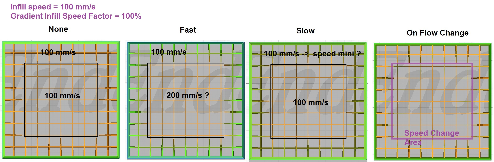

# Gradient Infill Speed Scheme

Le schéma de modification de la vitesse à utiliser lors de l'impression  d'un [remplissage graduel](gradient_infill_type.md). Rapide modifie la vitesse d'impression pour maintenir le taux d'extrusion constant, la vitesse d'impression peut à la fois augmenter et diminuer. Lent est similaire, mais la vitesse d'impression ne peut que diminuer. En cas de changement de flux, la vitesse d'impression est réduite lorsque le flux de remplissage change.

## Option de schéma de vitesse pour le remplissage en graduel 

- Rapide
- Lent
- Sur la modification des flux

Les schémas rapide et lent modifient tous deux la vitesse d'impression de manière à ce que l'extrudeuse tourne à la même vitesse pendant toute la durée du remplissage. Ainsi, pour les deux schémas, lorsque le débit double, la vitesse doit être divisée par deux, et ainsi de suite.

Le système rapide utilise la vitesse d'impression normale pour un débit normal. Ainsi, si la vitesse de remplissage normale est de 100 mm/s, vous obtiendrez 200 mm/S lorsque le débit est de 50 % et 50 mm/S lorsque le débit est de 200 %. Cela suppose que le facteur de vitesse de remplissage est de 100 %. Si vous le modifiez, les changements de vitesse seront plus ou moins importants selon que vous réduisez ou augmentez le facteur de vitesse. Notez que si vous modifiez le facteur de vitesse à partir de 100 %, le débit de l'extrudeuse changera.

Le schéma lent utilise la vitesse d'impression normale pour le débit le plus faible et tous les autres débits réduiront la vitesse d'impression. Ainsi, dans votre exemple, avec le schéma lent, à un débit de 50 %, la vitesse sera de 100 mm/s, à un débit de 100 %, la vitesse sera de 50 mm/s et à un débit de 200 %, la vitesse sera de 25 mm/s.

### [Gradient Infill Speed Factor](gradient_infill_speed_factor.md)
Évalue l'effet du schéma de vitesse de remplissage sur la vitesse d'impression.

### [Gradient Infill Distance](gradient_infill_dist.md)
Distance sur laquelle le débit de remplissage est réduit de max à min.

Le paramètre suivant est défini dans [fdmprinter.def.json](https://github.com/smartavionics/Cura/blob/mb-master/resources/definitions/fdmprinter.def.json) : gradient_infill_speed_scheme

