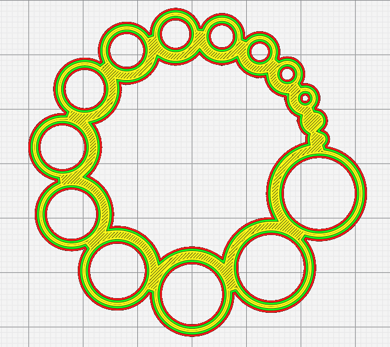
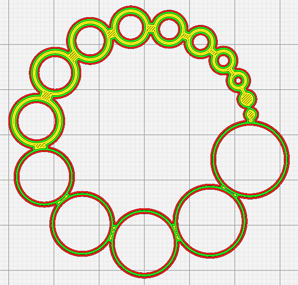

# Hole Horizontal Expansion Max Length

Lorsqu'il est non nul, [hole horizontal expansion](../shell/hole_xy_offset.md) n'est appliqué qu'aux trous dont la longueur du périmètre est inférieure à cette valeur.

La longueur maximale de l'expansion horizontale du trou est calculée automatiquement si vous modifiez le paramètre [Hole Horizontal Expansion Max Size](hole_xy_offset_max_size.md)

Le paramètre suivant est défini dans [fdmprinter.def.json](https://github.com/smartavionics/Cura/blob/mb-master/resources/definitions/fdmprinter.def.json) : hole_xy_offset_max_path_len

