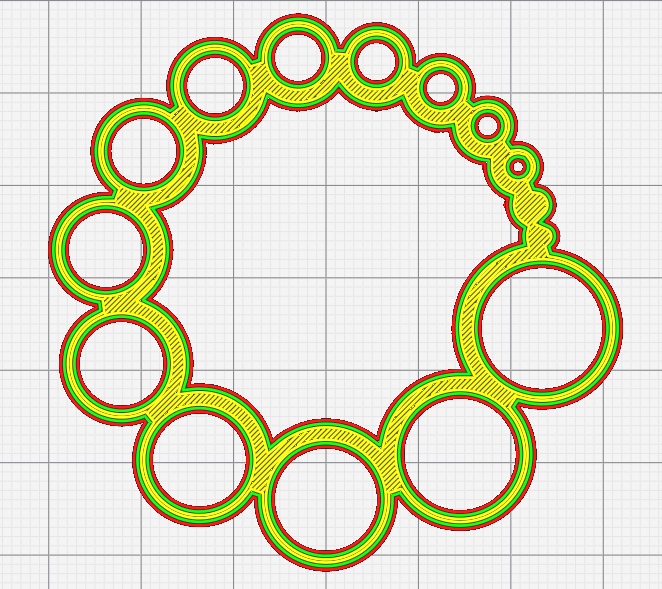
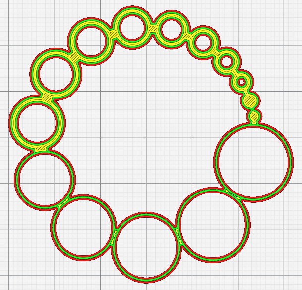

# Hole Horizontal Expansion Max Size

Lorsqu'il est non nul, [hole horizontal expansion](../shell/hole_xy_offset.md) n'est appliqué qu'aux trous dont le diamètre est inférieur à cette valeur.

Le paramètre suivant est défini dans [fdmprinter.def.json](https://github.com/smartavionics/Cura/blob/mb-master/resources/definitions/fdmprinter.def.json) : hole_xy_offset_max_size
