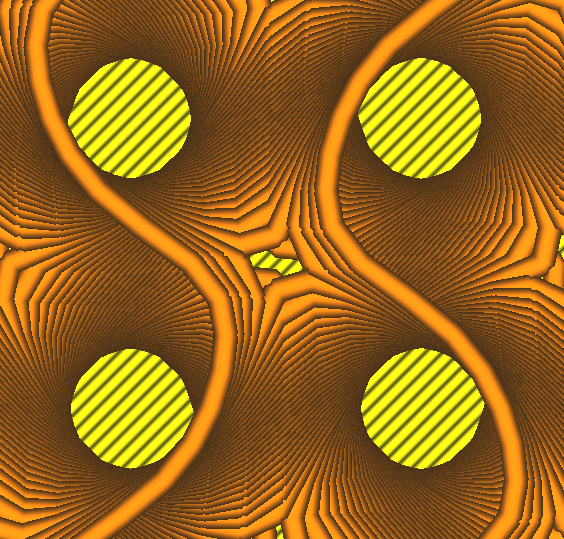

# Minimise Gyroid Holes

Lorsqu'il est activé, le pas de la ligne gyroïde est modifié de manière à ce que les lignes se croisent deux fois par cycle gyroïde. Cela permet de remplir partiellement les trous qui apparaissent souvent là où l'orientation des lignes change. Notez que l'activation de cette fonction rendra certaines densités de remplissage impossibles à imprimer, de sorte qu'une densité plus élevée pouvant être imprimée sera utilisée à la place. 

Cette fonction est désactivée lorsque [hauteurs des couches adaptatives](../experimental/adaptive_layer_height_enabled.md) sont activés.

Le paramètre suivant est défini dans [fdmprinter.def.json](https://github.com/smartavionics/Cura/blob/mb-master/resources/definitions/fdmprinter.def.json) : infill_constrain_gyroid_pitch

