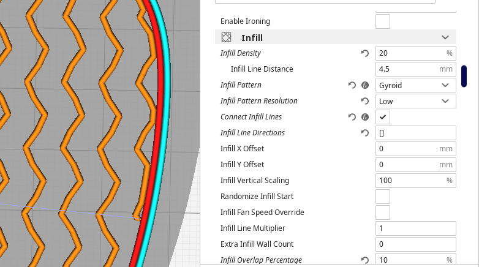

# Infill Pattern Resolution

La résolution du motif de remplissage de l'impression. La haute résolution produit le motif le plus précis, la basse résolution génère le moins de lignes.

### Motif de remplissage Options de résolution 

- Haut

- Moyen

- Faible

Le paramètre suivant est défini dans [fdmprinter.def.json](https://github.com/smartavionics/Cura/blob/mb-master/resources/definitions/fdmprinter.def.json) : infill_pattern_resolution