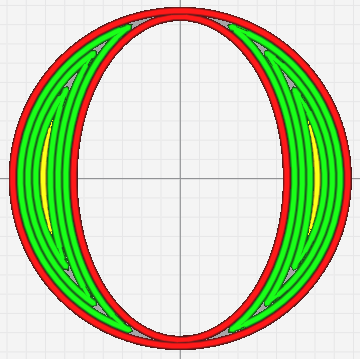
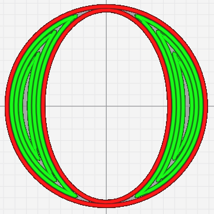

# Inner Layer Minimum Gap Area

Filtrer les lacunes des couches intérieures dont la surface est inférieure à cette valeur. Pour être efficace, l'option [Fill Gaps Between Walls](../shell/fill_perimeter_gap.md) must be active and must be set to ***Everywhere***.

Le paramètre suivant est défini dans [fdmprinter.def.json](https://github.com/smartavionics/Cura/blob/mb-master/resources/definitions/fdmprinter.def.json) : inner_layer_min_gap_area

