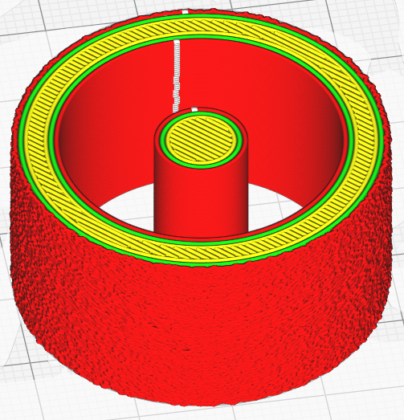

# Fuzzy Skin Outside Only Heuristics

Un masque de bits qui sélectionne la méthode heuristiques à utiliser pour déterminer si un mur est orienté vers l'extérieur ou non (YMMV). Les valeurs du masque de bits sont les suivantes : 1 = heuristique de la coque convexe. 2 = heuristique "ray-trace".

Le paramètre n'est visible que si l'option [Couche Floue à l'extérieur uniquement](../experimental/magic_fuzzy_skin_outside_only.md) est activée. Normalement pour Cura la notion de externe peut aussi inclure des frontières qui sont externe à la géométrie mais qui se retrouve à l'intérieure d'un ensemble. Avec cette option il est possible d'affiner la détection des frontières externes pour ne garder vraiment que les murs extérieurs.

Les paramètres suivants sont définis dans [fdmprinter.def.json](https://github.com/smartavionics/Cura/blob/mb-master/resources/definitions/fdmprinter.def.json) : magic_fuzzy_skin_outside_only_heuristics
