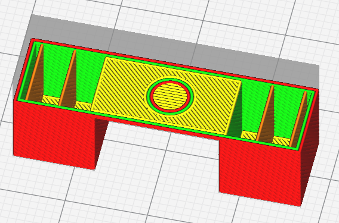

# Remove Holes Above Air

Retirez les trous de chaque couche qui ne sont pas soutenus par une couche inférieure. Cela permet d'enlever le fond du trou et de soutenir les murs périphériques du trou sur la couche suivante.

Le paramètre suivant est défini dans [fdmprinter.def.json](https://github.com/smartavionics/Cura/blob/mb-master/resources/definitions/fdmprinter.def.json) : meshfix_remove_holes_above_air

