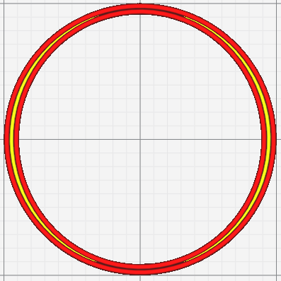
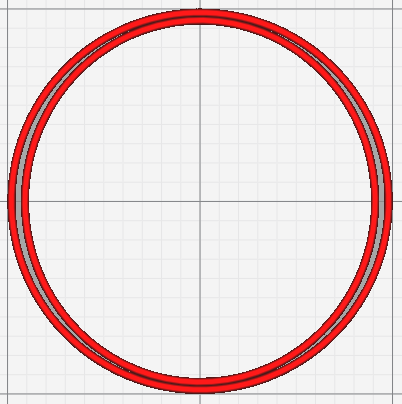

# Minimum Gap Area

Filtrer les espaces dont la surface est inférieure à cette valeur.  Pour être active, l'option [Remplir les espaces entre les murs](../shell/fill_perimeter_gap.md) doit être actif.

Le paramètre suivant est défini dans [fdmprinter.def.json](https://github.com/smartavionics/Cura/blob/mb-master/resources/definitions/fdmprinter.def.json) : min_gap_area