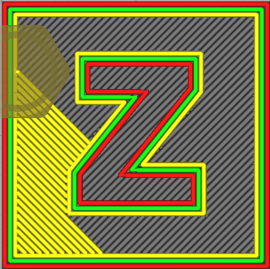
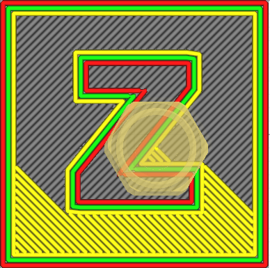

# Monotonic Skin Lines (mb-master)

Imprimez les lignes de la peau de manière monotone. Cela peut améliorer la qualité visuelle de la peau. S'applique uniquement lorsque la fonction "Lignes"  pour le [motif du dessus/dessous](../top_bottom/top_bottom_pattern.md) est activée.

Ce paramètre a été introduit avant que la version officielle de Cura n'intègre sa propre option de remplissage monotone [Ordre monotone dessus/dessous](../top_bottom/skin_monotonic.md). Le résultat obtenu étant différent, l'option de remplissage Cura-MAster a été conservée. 

En fonction du résultat obtenu, vous pouvez décider d'activer l'un ou l'autre ordre monotone de remplissage.

Notez que si le remplissage monotone de la version officielle de Cura est déjà actif, vous ne pouvez pas activer cette option.

Le paramètre suivant est défini dans [fdmprinter.def.json](https://github.com/smartavionics/Cura/blob/mb-master/resources/definitions/fdmprinter.def.json) : monotonic_skin_lines
