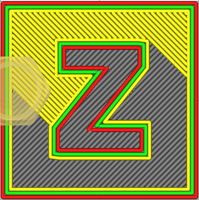
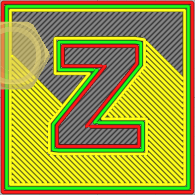

# Reverse Monotonic Line Order

Imprimer le [skin lines monotonically](monotonic_skin_lines.md) dans l'ordre inverse.

Le paramètre suivant est défini dans [fdmprinter.def.json](https://github.com/smartavionics/Cura/blob/mb-master/resources/definitions/fdmprinter.def.json) : monotonic_skin_lines_reversed

