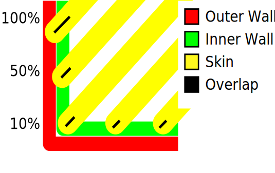

# Top Surface Skin Overlap Percentage

Adjust the amount of overlap between the walls and (the endpoints of) the top surface skin-centerlines, as a percentage of the line widths of the skin lines and the innermost wall. A slight overlap allows the walls to connect firmly to the skin. 

To be enabled the [Top Surface Skin Layers](../top_bottom/roofing_layer_count.md) must be  > 0 and [Top/Bottom Pattern](../top_bottom/top_bottom_pattern.md) must be different from  'Concentric'.

Note that, given an equal skin and wall line-width, any percentage over 50% may already cause any skin to go past the wall, because at that point the position of the nozzle of the skin-extruder may already reach past the middle of the wall.

Le paramètre suivant est défini dans [fdmprinter.def.json](https://github.com/smartavionics/Cura/blob/mb-master/resources/definitions/fdmprinter.def.json) : roofing_overlap

