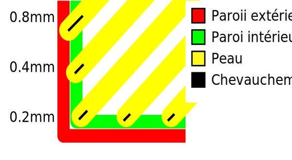

# Top Surface Skin Overlap

Ajustez le degré de chevauchement entre les parois et (les points d'extrémité des) lignes médianes de la peau de la surface supérieure. Un léger chevauchement permet aux murs de se connecter fermement à la peau. Notez qu'à largeur égale des lignes de peau et de paroi, toute valeur supérieure à la moitié de la largeur de la paroi peut déjà faire passer la peau au-delà de la paroi, car à ce moment-là, la position de la buse de l'extrudeuse de peau peut déjà dépasser le milieu de la paroi.

Pour être activée, la [Couches extérieures de la surface supérieure](../top_bottom/roofing_layer_count.md) doit être > 0 et [Motif haut/bas](../top_bottom/top_bottom_pattern.md) doit être différent de 'Concentrique'.

Le paramètre suivant est défini dans [fdmprinter.def.json](https://github.com/smartavionics/Cura/blob/mb-master/resources/definitions/fdmprinter.def.json) : roofing_overlap_mm

