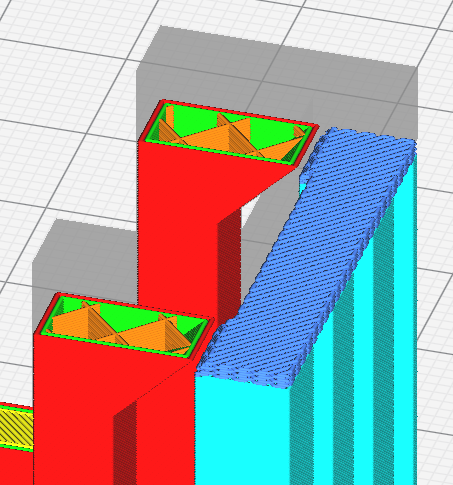
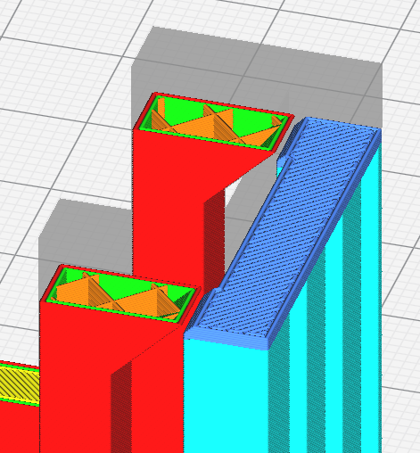

# Support Interface Wall Line Count

Le nombre de murs qui entourent l'interface du support. L'ajout d'un mur peut rendre l'impression du support plus fiable et peut mieux supporter les surplombs, mais augmente le temps d'impression et la matière utilisée.

Ce paramètre peut être subdivisé en deux sous paramètres, l'un pour le réglage du nombre de ligne [Support Bottom Wall line Count](support_bottom_wall_count.md), l'autre pour le [Support Roof Wall line Count](support_roof_wall_count.md).

Le paramètre suivant est défini dans [fdmprinter.def.json](https://github.com/smartavionics/Cura/blob/mb-master/resources/definitions/fdmprinter.def.json) : support_interface_wall_count