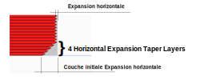

# Horizontal Expansion Taper Layers

L'expansion horizontale va en s'amenuisant à partir de la [valeur utilisée pour la couche initiale](../shell/xy_offset_layer_0.md) à la [valeur utilisée pour les couches suppérieures](../shell/xy_offset.md) sur autant de couches.

Le paramètre suivant est défini dans [fdmprinter.def.json](https://github.com/smartavionics/Cura/blob/mb-master/resources/definitions/fdmprinter.def.json) : xy_offset_taper_layers